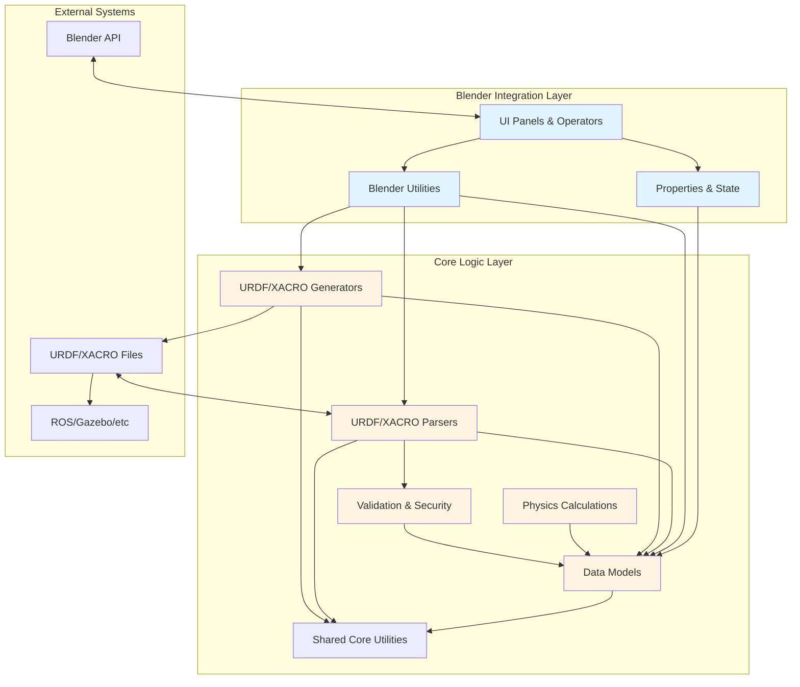
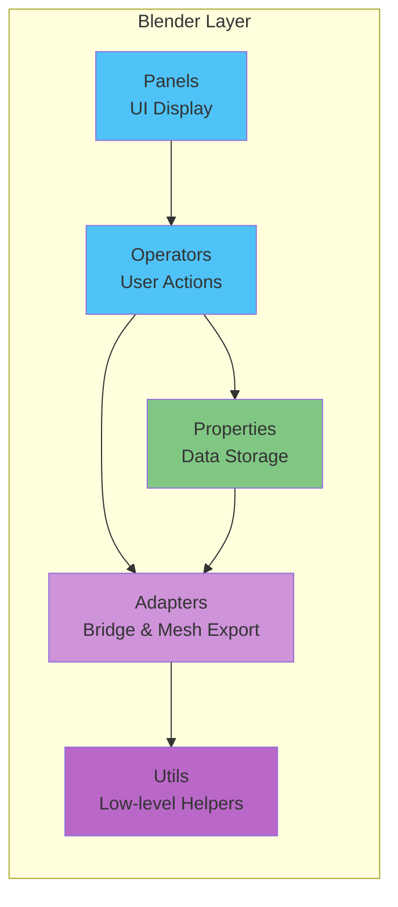
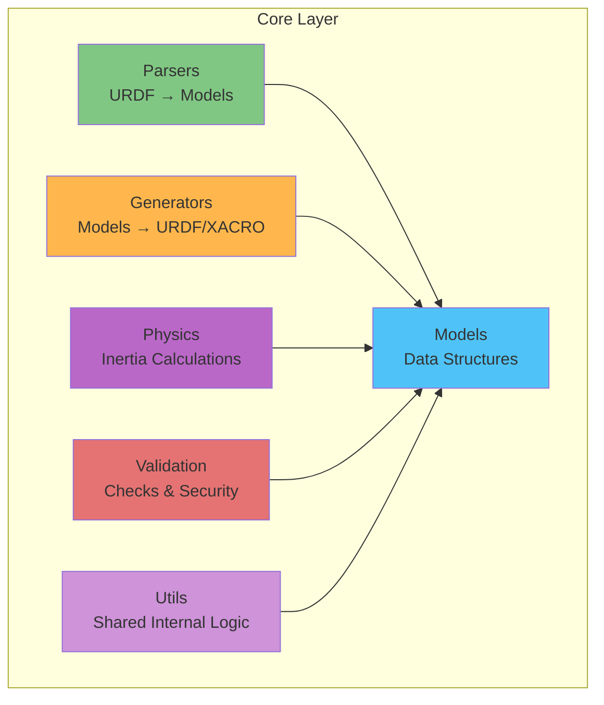
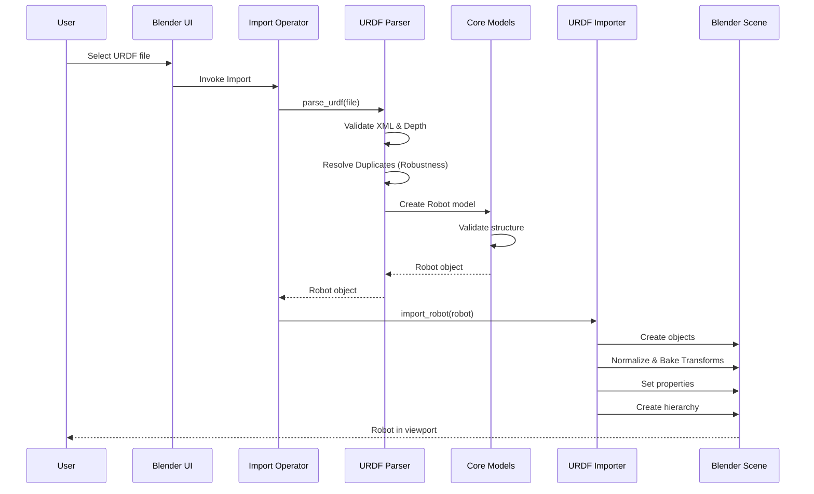
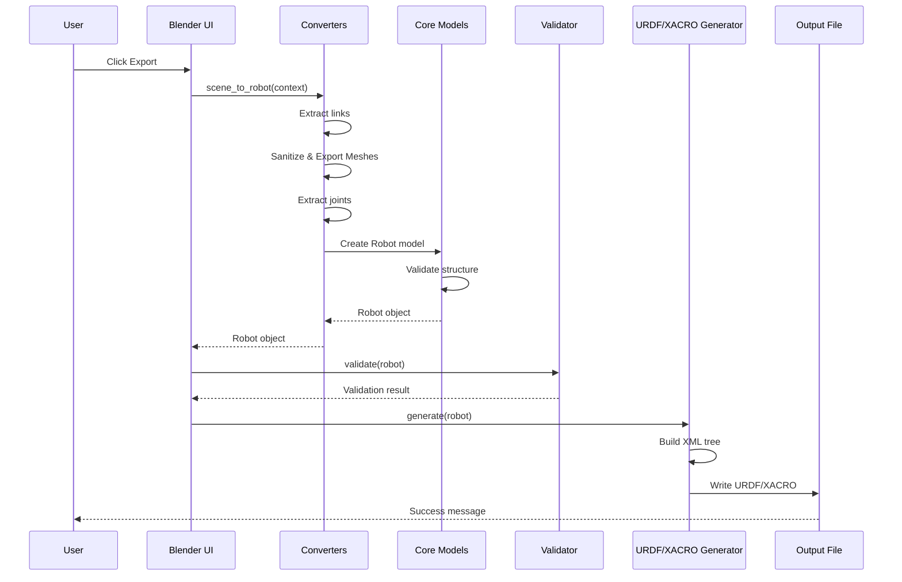
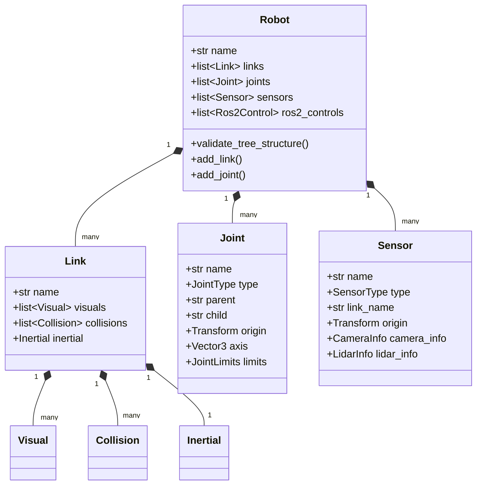
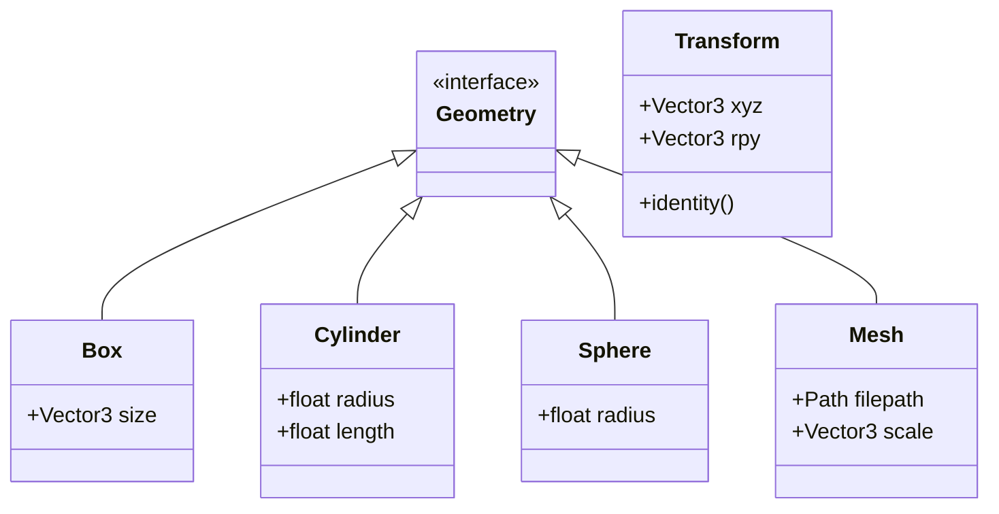
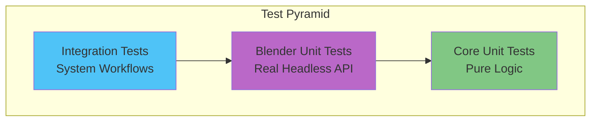

# LinkForge Architecture

This document provides a comprehensive overview of LinkForge's architecture, module organization, and data flow.

## System Overview

LinkForge is a Blender extension that bridges the gap between 3D modeling and robotics simulation. Its internal architecture is organized into **two primary layers**, which together interface with the broader robotics ecosystem:



## Module Structure

### 1. Blender Integration Layer (`platforms/blender/`)

Handles all Blender-specific functionality and UI.



#### Components

| Module | Purpose | Key Files |
|--------|---------|-----------|
| **Panels** | UI layout and display | `robot_panel.py`, `joint_panel.py`, `link_panel.py`, `sensor_panel.py`, `control_panel.py`, `forge_panel.py` |
| **Operators** | User actions (import, export, etc.) | `import_ops.py`, `export_ops.py`, `link_ops.py`, `joint_ops.py`, `sensor_ops.py`, `control_ops.py`, `transmission_ops.py` (Legacy) |
| **Properties** | Blender scene data storage | `robot_props.py`, `joint_props.py`, `link_props.py`, `sensor_props.py`, `control_props.py`, `validation_props.py`, `transmission_props.py` (Legacy) |
| **Adapters** | Conversion between Blender ↔ Core | `converters.py`, `scene_builder.py`, `mesh_export.py` |
| **Utils** | Blender-specific helpers | `joint_gizmos.py`, `inertia_gizmos.py`, `property_helpers.py`, `transform_utils.py`, `scene_utils.py`, `joint_utils.py`, `decorators.py` |

### 2. Core Logic Layer (`core/src/linkforge_core/`)

Platform-independent robot modeling and URDF/XACRO processing.



#### Components

| Module | Purpose | Key Files/Classes |
|--------|---------|-------------|
| **Models** | Core data structures | `Robot`, `Link`, `Joint`, `Sensor`, `Ros2Control`, `Transmission` (Legacy) |
| **Parsers** | URDF/XACRO → Python objects | `parsers/urdf_parser.py`, `parsers/xacro_parser.py` |
| **Generators** | Python objects → URDF/XACRO | `urdf_generator.py`, `xacro_generator.py` |
| **Physics** | Mass & inertia calculations | `physics/inertia.py` |
| **Validation** | Error checking & security | `validation/validator.py`, `validation/security.py` |
| **Utils** | Unified internal logic | `utils/math_utils.py`, `utils/string_utils.py`, `utils/xml_utils.py`, `utils/kinematics.py` |

## Data Flow

### Import Workflow (URDF → Blender)



### Export Workflow (Blender → URDF/XACRO)



## Core Data Models

### Robot Model Hierarchy



### Geometry Models



## Key Design Patterns

### 1. **Immutable Data Models**
All core models use `@dataclass(frozen=True)` for thread safety and predictable behavior.

```python
@dataclass(frozen=True)
class Link:
    name: str
    visuals: list[Visual]
    collisions: list[Collision]
    inertial: Inertial | None
```

### 2. **Validation at Construction**
Models validate themselves in `__post_init__()` to ensure data integrity.

```python
def __post_init__(self) -> None:
    if not self.name:
        raise ValueError("Link name cannot be empty")
    if self.inertial and self.inertial.mass <= 0:
        raise ValueError("Mass must be positive")
```

### 3. **Resilient Parsing & Duplicate Resolution**
Parser logic is designed to be highly resilient to malformed or non-compliant URDFs.
- **Graceful Failure**: Individual invalid elements (e.g., malformed joints) are skipped with warnings rather than halting the process.
- **Duplicate Resolution**: If duplicate link or joint names are detected, LinkForge automatically renames them (e.g., `link_duplicate_1`) to preserve kinematic integrity while maintaining compliance with Blender/Core unique naming requirements.

### 4. **Recursive Normalization (v1.2.0)**
To handle "dirty" mesh hierarchies (common in CAD imports), the Builder employs a recursive normalization strategy:
- **Unparenting**: Detaches objects while preserving world transforms.
- **Baking**: Applies rotation and scale to the mesh data.
- **Resetting**: Snaps the object origin to `(0,0,0)` to prevent "Double Offset" drift during round-trips.

### 5. **Atomic Sanitization (v1.2.0)**
All user input (names, file paths) is sanitized at the edge of the system (during Export) to ensure OS and URDF compatibility without restricting the user's Blender naming conventions.

## Extension Points

### Adding New Sensor Types

1. Add enum to `SensorType` in `models/sensor.py`
2. Create info dataclass (e.g., `MyNewSensorInfo`)
3. Add parsing logic in `parsers/urdf_parser.py`
4. Add generation logic in `urdf_generator.py`
5. Add Blender UI in `panels/sensor_panel.py`

### Adding New Joint Types

1. Add enum to `JointType` in `models/joint.py`
2. Update validation in `Joint.__post_init__()`
3. Update parser in `parsers/urdf_parser.py`
4. Update generator in `urdf_generator.py`
5. Add gizmo visualization in `utils/joint_gizmos.py`

## Performance Considerations

### Mesh Processing
- **Inertia calculation**: O(n) where n = triangle count
- **Primitive detection**: O(1) with tolerance checks
- **Mesh export**: Cached to avoid redundant I/O

### URDF Parsing
- **XML parsing**: O(n) where n = file size
- **Tree validation**: O(V + E) where V = links, E = joints
- **Security checks**: O(1) per mesh path

### Blender Integration
- **Scene conversion**: O(n) where n = objects in scene
- **Property updates**: O(1) with Blender's property mirroring
- **Viewport updates**: Throttled to 60 FPS max

## Testing Strategy



### Test Categories
- **Unit Tests (Core)**: Isolated tests for platform-independent data models and math.
- **Unit Tests (Blender)**: Tests for Blender-specific logic running in a real headless Blender environment.
- **Integration Tests**: Full workflow validation organized into specialized subdirectories:
  - `parsers/`: URDF/Xacro parsing logic and complex includes.
  - `blender/`: End-to-end Roundtrip (Import → Scene Setup → Export).
  - `features/`: Specific functionality like Inertia, **Sanitization**, and **Normalization**.

## Security Architecture

### Defense Layers

1. **Input Validation**
   - XML depth limits (prevent XML bombs)
   - Numeric range checks (prevent NaN/Inf)
   - String sanitization (prevent injection)

2. **Path Security**
   - Mesh path validation (prevent traversal outside Sandbox Root)
   - Sandbox Root Auto-Detection (allows sibling folders)
   - Package URI validation
   - Strict Whitelist-based approach

3. **Resource Limits**
   - Max file size: 100 MB
   - Max XML depth: 100 levels
   - Max numeric value: ±1e10


## Scalability
- **Complex Robots**: Supports multi-link chains, branched trees, and multi-sensor configurations.
- Parser handles files up to 100 MB
- Blender integration tested with complex quadrupeds

### 5. **Data Integrity & Preservation**
LinkForge distinguishes between user-created assets and imported "Source of Truth" assets. Imported assets are locked to prevent accidental modification during the Blender iterative workflow.

---

**Last Updated:** 2026-02-03
**Version:** 1.2.0 (Architectural Stability & Precision)
