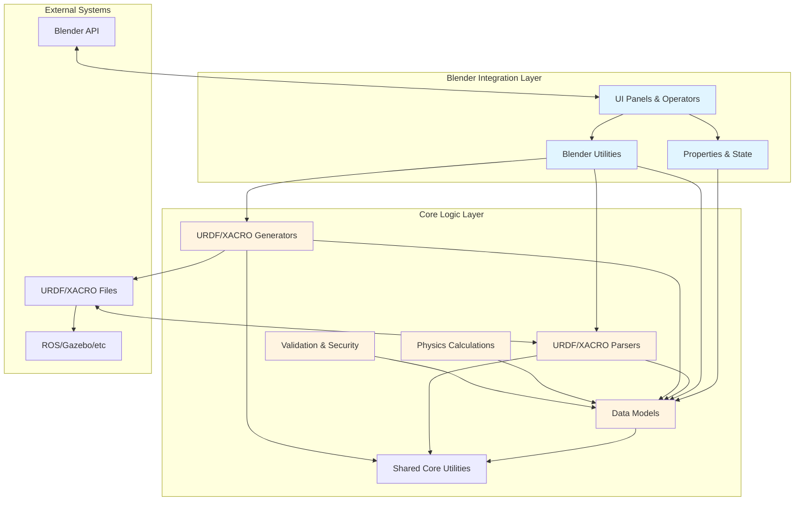
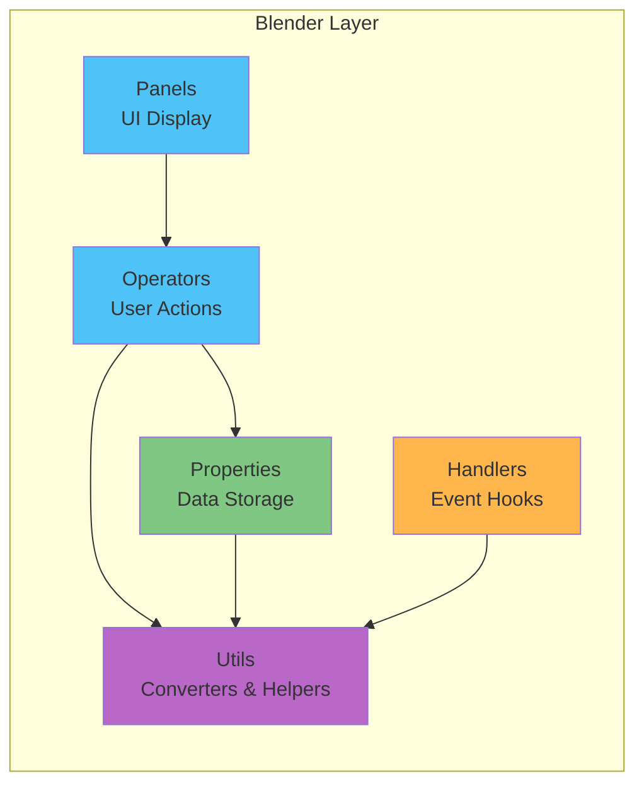
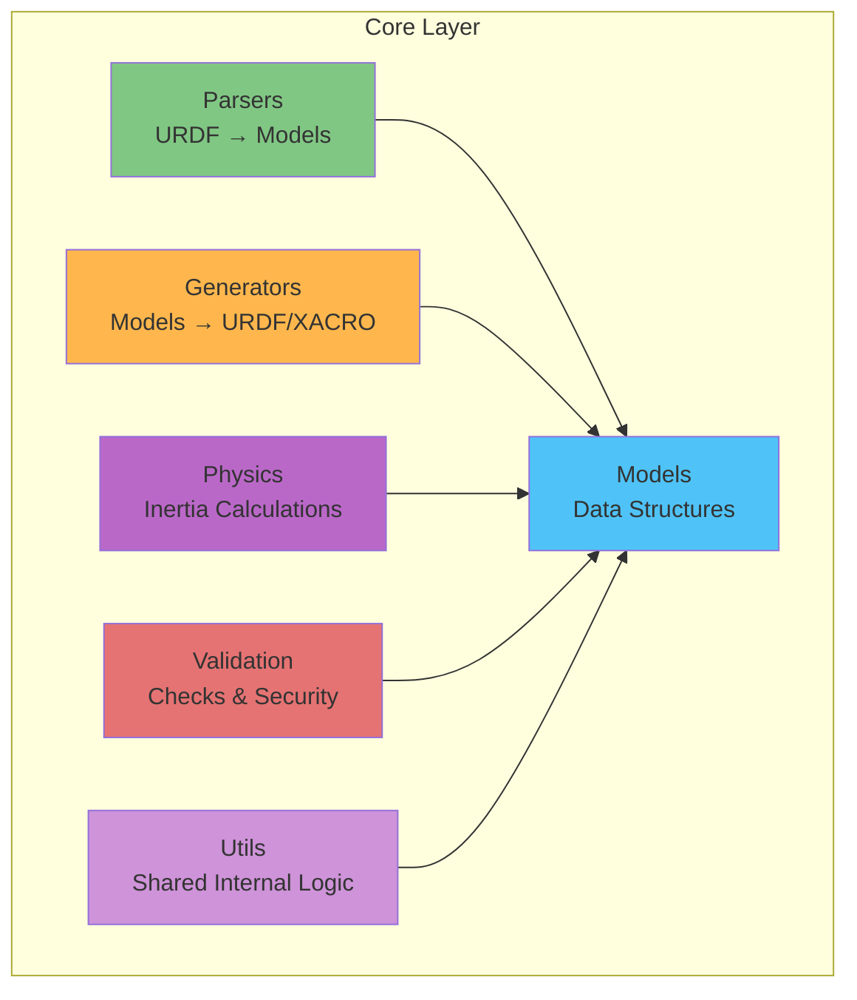
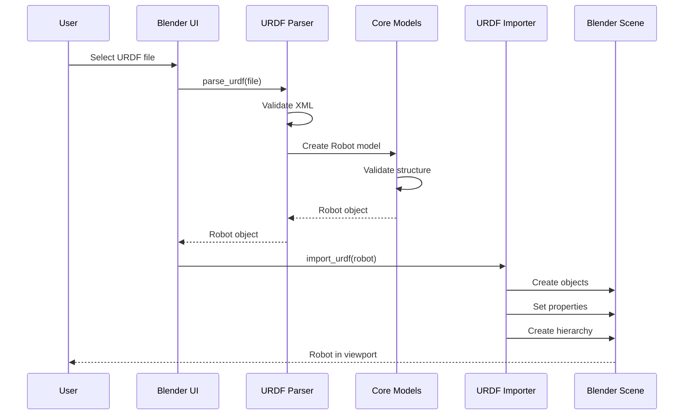
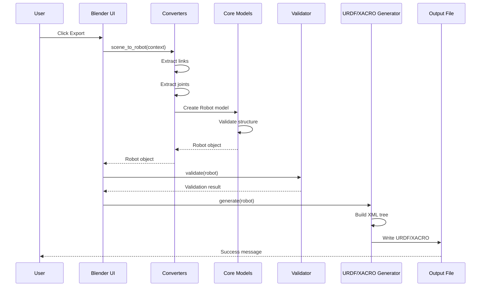
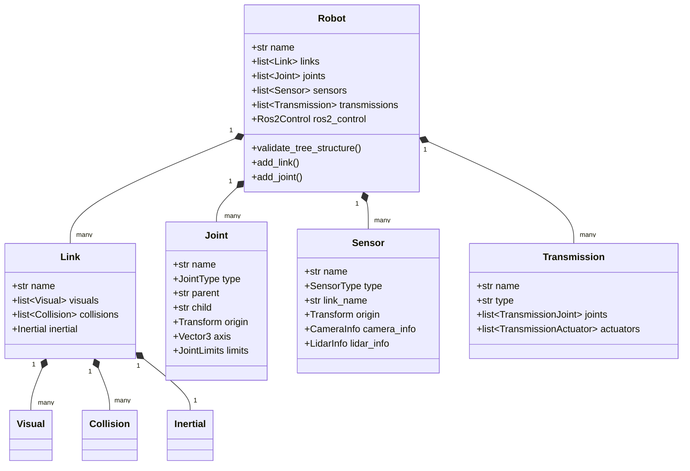
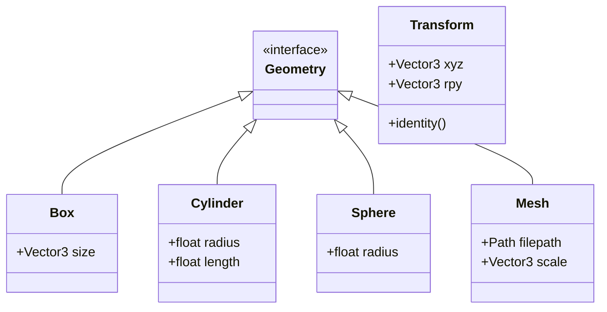
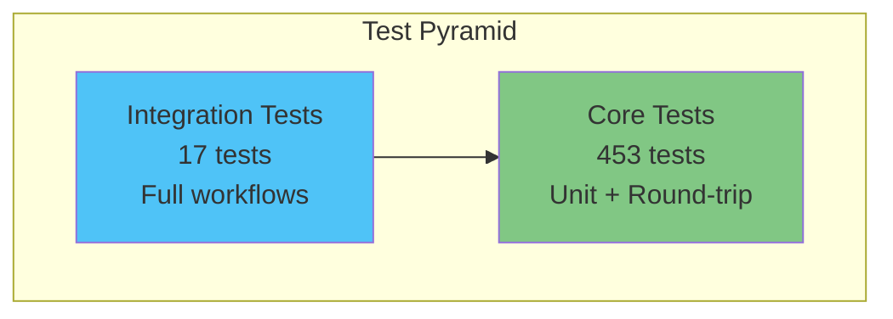

# LinkForge Architecture

This document provides a comprehensive overview of LinkForge's architecture, module organization, and data flow.

## System Overview

LinkForge is a Blender extension that bridges the gap between 3D modeling and robotics simulation. It consists of three main layers:



## Module Structure

### 1. Blender Integration Layer (`linkforge/blender/`)

Handles all Blender-specific functionality and UI.



#### Components

| Module | Purpose | Key Files |
|--------|---------|-----------|
| **Panels** | UI layout and display | `robot_panel.py`, `joint_panel.py`, `link_panel.py` |
| **Operators** | User actions (create, export, etc.) | `export_ops.py`, `link_ops.py`, `joint_ops.py` |
| **Properties** | Blender scene data storage | `robot_props.py`, `joint_props.py`, `link_props.py` |
| **Utils** | Conversion between Blender ↔ Core | `converters.py`, `urdf_importer.py`, `mesh_export.py` |
| **Handlers** | Event listeners (file load, etc.) | `handlers.py` |

### 2. Core Logic Layer (`linkforge/core/`)

Platform-independent robot modeling and URDF/XACRO processing.



#### Components

| Module | Purpose | Key Classes |
|--------|---------|-------------|
| **Models** | Core data structures | `Robot`, `Link`, `Joint`, `Sensor`, `Transmission` |
| **Parsers** | URDF/XACRO → Python objects | `parse_urdf()`, `parse_xacro()` |
| **Generators** | Python objects → URDF/XACRO | `URDFGenerator`, `XACROGenerator` |
| **Physics** | Mass & inertia calculations | `calculate_mesh_inertia()`, primitive formulas |
| **Validation** | Error checking & security | `RobotValidator`, `validate_mesh_path()` |
| **Utils** | Unified internal logic | `math_utils.py`, `string_utils.py` |

## Data Flow

### Import Workflow (URDF → Blender)



### Export Workflow (Blender → URDF/XACRO)



## Core Data Models

### Robot Model Hierarchy



### Geometry Models



## Key Design Patterns

### 1. **Immutable Data Models**
All core models use `@dataclass(frozen=True)` for thread safety and predictable behavior.

```python
@dataclass(frozen=True)
class Link:
    name: str
    visuals: list[Visual]
    collisions: list[Collision]
    inertial: Inertial | None
```

### 2. **Validation at Construction**
Models validate themselves in `__post_init__()` to ensure data integrity.

```python
def __post_init__(self) -> None:
    if not self.name:
        raise ValueError("Link name cannot be empty")
    if self.inertial and self.inertial.mass <= 0:
        raise ValueError("Mass must be positive")
```

### 3. **Resilient Parsing**
Parser logs warnings and continues instead of crashing on minor issues.

```python
try:
    geometry = parse_box(elem)
except ValueError as e:
    logger.warning(f"Invalid geometry: {e}")
    return None  # Skip invalid element
```

### 4. **O(1) Lookups**
Robot model maintains internal indices for fast access.

```python
class Robot:
    _links_map: dict[str, Link]  # O(1) lookup by name
    _joints_map: dict[str, Joint]
    _adjacency_list: dict[str, list[str]]  # For tree traversal
```

## Extension Points

### Adding New Sensor Types

1. Add enum to `SensorType` in `models/sensor.py`
2. Create info dataclass (e.g., `MyNewSensorInfo`)
3. Add parsing logic in `parsers/urdf_parser.py`
4. Add generation logic in `generators/urdf.py`
5. Add Blender UI in `panels/sensor_panel.py`

### Adding New Joint Types

1. Add enum to `JointType` in `models/joint.py`
2. Update validation in `Joint.__post_init__()`
3. Update parser in `parsers/urdf_parser.py`
4. Update generator in `generators/urdf.py`
5. Add gizmo visualization in `utils/joint_gizmos.py`

## Performance Considerations

### Mesh Processing
- **Inertia calculation**: O(n) where n = triangle count
- **Primitive detection**: O(1) with tolerance checks
- **Mesh export**: Cached to avoid redundant I/O

### URDF Parsing
- **XML parsing**: O(n) where n = file size
- **Tree validation**: O(V + E) where V = links, E = joints
- **Security checks**: O(1) per mesh path

### Blender Integration
- **Scene conversion**: O(n) where n = objects in scene
- **Property updates**: O(1) with Blender's property system
- **Viewport updates**: Throttled to 60 FPS max

## Testing Strategy



### Test Categories
- **Unit Tests**: Individual functions and classes
- **Round-Trip Tests**: Import → Export → Import verification
- **Integration Tests**: Full workflow validation
- **Security Tests**: Path traversal, XML bombs, etc.

## Security Architecture

### Defense Layers

1. **Input Validation**
   - XML depth limits (prevent XML bombs)
   - Numeric range checks (prevent NaN/Inf)
   - String sanitization (prevent injection)

2. **Path Security**
   - Mesh path validation (prevent traversal)
   - Package URI validation
   - Whitelist-based approach

3. **Resource Limits**
   - Max file size: 100 MB
   - Max XML depth: 100 levels
   - Max numeric value: ±1e10

## Future Architecture Considerations

### Planned Enhancements
- [ ] Plugin system for custom exporters
- [ ] Undo/redo support for operations
- [ ] Multi-robot scene support
- [ ] Real-time validation feedback
- [ ] Cloud-based robot library

### Scalability
- Current design supports robots up to ~1000 links
- Parser handles files up to 100 MB
- Blender integration tested with complex quadrupeds

---

**Last Updated:** 2025-12-23
**Version:** 1.0.0
