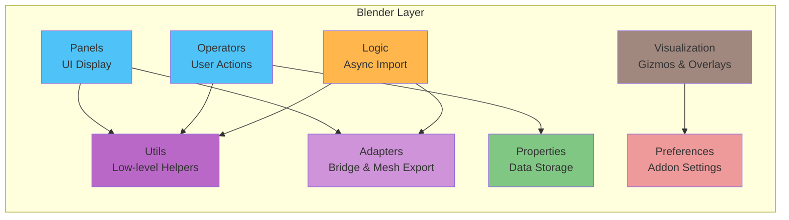
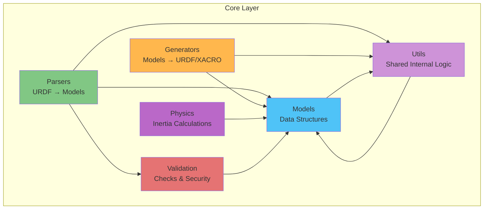
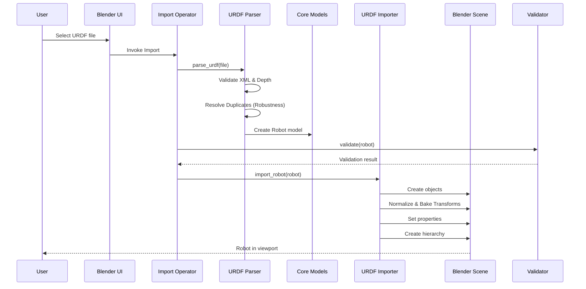
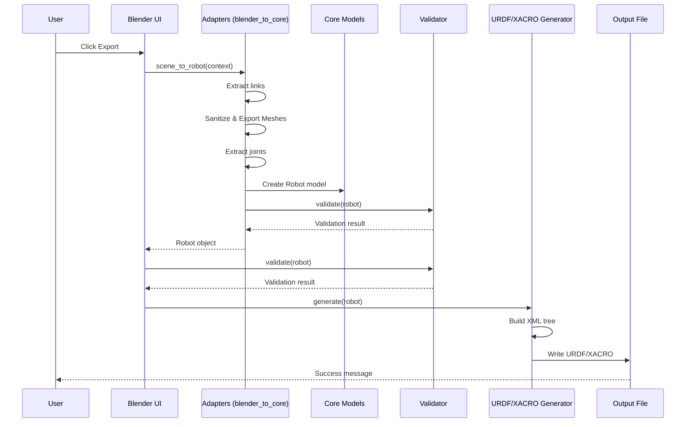
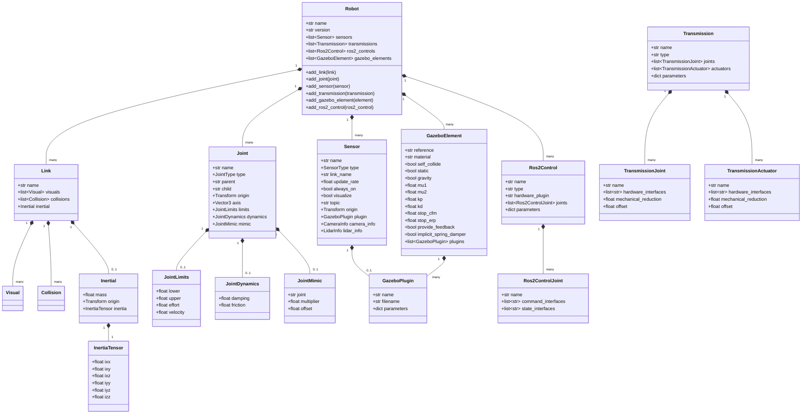
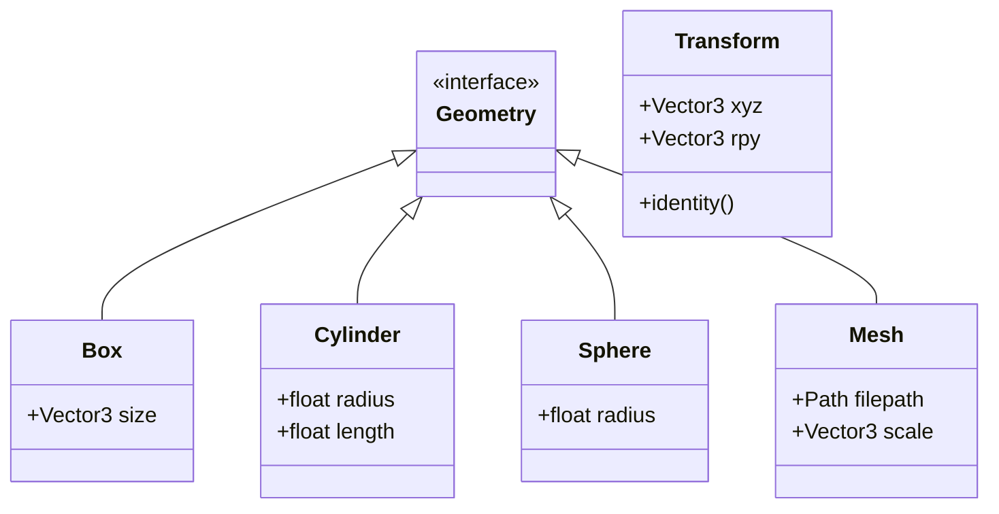
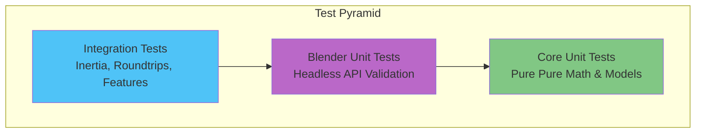

# LinkForge Architecture

This document provides a comprehensive overview of LinkForge's architecture, module organization, and data flow.

## System Overview

LinkForge is **The Linter & Bridge for Robotics**. Its internal architecture is organized into **two primary layers**, which together interface with the broader robotics ecosystem.

## Module Structure

### 1. Blender Integration Layer (`platforms/blender/`)

Handles all Blender-specific functionality and UI.



#### Components

| Module | Purpose |
|--------|----------|
| **Adapters** | Conversion between Blender ↔ Core (Directional) |
| **Logic** | Async robot import orchestration |
| **Visualization** | Viewport overlays and gizmos |
| **UI** | Panels and Operators |
| **Preferences** | Addon settings and toggle callbacks |
| **Properties** | Blender-side property definitions |
| **Utils** | Shared helpers (decorators, context guards) |

### Adapters Layer

Located in `linkforge/blender/adapters/`, these files follow a **directional naming pattern** to make data flow explicit:

1.  **`blender_to_core.py`**: Handles the "Export" flow (converting Blender objects to Core models).
2.  **`core_to_blender.py`**: Handles the "Import" flow (converting Core models into Blender objects).
3.  **`mesh_io.py`**: Manages mesh file reading/writing and sanitization.

This structure allows LinkForge to remain "Orthogonal"—new 3D hosts (like FreeCAD) can be added by creating a corresponding `adapters/` package without touching the Core.

### 2. Core Logic Layer (`core/src/linkforge_core/`)

Platform-independent robot modeling and URDF/XACRO processing.



#### Components

| Module | Purpose |
|--------|----------|
| **Models** | Core data structures (`Robot`, `Link`, `Joint`, `Sensor`, `Ros2Control`, `Transmission`, `GazeboElement`) |
| **Parsers** | URDF/XACRO → Python objects |
| **Generators** | Python objects → URDF/XACRO |
| **Physics** | Mass & inertia calculations |
| **Validation** | Error checking & security |
| **Utils** | Shared internal logic (math, strings, XML, kinematics) |

## Data Flow

### Import Workflow (URDF → Blender)



### Export Workflow (Blender → URDF/XACRO)



## Core Data Models

### Robot Model Hierarchy



### Geometry Models



## Key Design Patterns

### 1. **Immutable Data Models**
All core models use `@dataclass(frozen=True)` for thread safety and predictable behavior.

```python
@dataclass(frozen=True)
class Link:
    name: str
    visuals: list[Visual]
    collisions: list[Collision]
    inertial: Inertial | None
```

### 2. **Validation at Construction**
Models validate themselves in `__post_init__()` to ensure data integrity.

```python
def __post_init__(self) -> None:
    if not self.name:
        raise ValueError("Link name cannot be empty")
    if self.inertial and self.inertial.mass <= 0:
        raise ValueError("Mass must be positive")
```

### 3. **Resilient Parsing & Duplicate Resolution**
Parser logic is designed to be highly resilient to malformed or non-compliant URDFs.
- **Graceful Failure**: Individual invalid elements (e.g., malformed joints) are skipped with warnings rather than halting the process.
- **Duplicate Resolution**: If duplicate link or joint names are detected, LinkForge automatically renames them (e.g., `link_duplicate_1`) to preserve kinematic integrity while maintaining compliance with Blender/Core unique naming requirements.

### 4. **Recursive Normalization**
To handle "dirty" mesh hierarchies (common in CAD imports), the Builder employs a recursive normalization strategy:
- **Unparenting**: Detaches objects while preserving world transforms.
- **Baking**: Applies rotation and scale to the mesh data.
- **Resetting**: Snaps the object origin to `(0,0,0)` to prevent "Double Offset" drift during round-trips.

### 5. **Atomic Sanitization**
All user input (names, file paths) is sanitized at the edge of the system (during Export) to ensure OS and URDF compatibility without restricting the user's Blender naming conventions.

### 6. **Data Integrity & Preservation**
LinkForge distinguishes between user-created assets and imported "Source of Truth" assets. Imported assets are locked to prevent accidental modification during the Blender iterative workflow.

## Extension Points

As an extensible framework, LinkForge is designed with clear "hooks" for adding new robotics features.

### Adding New Sensor Types
To support a new sensor (e.g., a custom LiDAR or Depth Camera variant):
1. **Model**: Add enum to `SensorType` and create a metadata dataclass in `linkforge_core/models/sensor.py`.
2. **Parser**: Update `URDFParser._parse_sensor` in `linkforge_core/parsers/urdf_parser.py`.
3. **Generator**: Add XML mapping in `linkforge_core/generators/urdf_generator.py`.
4. **UI**: Add property group and panel logic in `blender/properties/sensor_props.py` and `blender/panels/sensor_panel.py`.

### Adding New Joint Types
To implement experimental joint types (e.g., screw joints or custom bushings):
1. **Model**: Add enum to `JointType` in `linkforge_core/models/joint.py`.
2. **Validation**: Update `Joint.__post_init__` for type-specific constraints.
3. **Parser/Generator**: Update the corresponding logic in `urdf_parser.py` and `urdf_generator.py`.
4. **Gizmos**: Add custom drawing logic in `blender/visualization/joint_gizmos.py`.

### Adding New Mesh Formats
To support additional 3D formats (e.g., USD or PLY):
1. **Core**: Ensure `Mesh` model handles paths correctly in `linkforge_core/models/geometry.py`.
2. **Blender Logic**: Implement the export wrapper in `blender/adapters/mesh_io.py`.
3. **UI/Export**: Add the format option to the global `RobotPropertyGroup` in `blender/properties/robot_props.py`.

## Performance Considerations

### Core Optimizations
- **Inertia calculation**: O(n) where n = triangle count (canonical integration).
- **Primitive detection**: O(1) using mesh topology heuristics.
- **Viewport interaction**: Debounced (0.3s delay) for responsive UI during property manipulation.
- **Lookup efficiency**: O(1) hash-map indexing for links and joints.

### Scalability
- **Complex Robots**: Supports multi-link chains, branched trees, and multi-sensor configurations.
- **Large Files**: Tested with URDF/XACRO assets up to 100 MB.
- **Headless Mode**: Fully optimized for automated CI and background processing.

### Testing Strategy



Comprehensive execution instructions and setup details for each layer are maintained in the **[CONTRIBUTING.md](https://github.com/arounamounchili/linkforge/blob/main/CONTRIBUTING.md#testing)** guide.

## Security by Design

LinkForge implements a multi-layered security architecture to protect against malicious URDF/XACRO inputs:

1. **Sandboxed I/O**: The **Sandbox Root** auto-detection prevents path traversal attacks by restricting mesh asset access to the robot's package directory.
2. **Resource Throttling**: Hard limits on file size (100MB), XML nesting depth (100), and numeric ranges (±1e10) protect against "Billion Laughs" attacks and system resource exhaustion.
3. **Atomic Sanitization**: All incoming strings (links, joints, meshes) are sanitized at the engine's edge to ensure validity for both URDF XML and cross-platform filesystems.
4. **Validation Pass**: The `RobotValidator` performs a pre-export sanity check to ensure kinematic connectivity and physical property validity.


---

**Last Updated:** 2026-02-19
**Version:** 1.2.3
