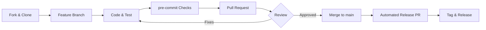

# Contributing to LinkForge

Thank you for your interest in contributing to LinkForge! This guide will help you get started.

## Table of Contents

- [Code of Conduct](#code-of-conduct)
- [Getting Started](#getting-started)
- [Development Setup](#development-setup)
- [Project Structure](#project-structure)
- [Development Workflow](#development-workflow)
- [Testing](#testing)
- [Code Style](#code-style)
- [Submitting Changes](#submitting-changes)
- [Release Process](#release-process)

## Code of Conduct

Be respectful, inclusive, and professional. We're all here to build great robotics tools together.

## Getting Started

### Prerequisites

- **Python 3.11+**
- **Blender 4.2+**
- **Git**
- **uv** (Python package manager) - Install: `curl -LsSf https://astral.sh/uv/install.sh | sh`

### Fork and Clone

```bash
# Fork the repository on GitHub, then:
git clone https://github.com/YOUR_USERNAME/linkforge.git
cd linkforge
```

## Development Setup

### 1. Install Dependencies

```bash
# Install all development dependencies
uv sync

# Activate virtual environment
source .venv/bin/activate  # On macOS/Linux
# or
.venv\Scripts\activate  # On Windows
```

### 2. Install Pre-commit Hooks

```bash
# Install pre-commit hooks for automatic code quality checks
uv run pre-commit install
```

### 3. Verify Setup

```bash
# Run tests to verify everything works
uv run pytest

# Run linter
uv run ruff check linkforge/

# Build extension
python3 build_extension.py
```

## Project Structure

```
linkforge/
├── linkforge/              # Main package
│   ├── blender/           # Blender integration layer
│   │   ├── operators/     # User actions (export, create, etc.)
│   │   ├── panels/        # UI panels
│   │   ├── properties/    # Blender scene properties
│   │   └── utils/         # Blender-specific utilities
│   └── core/              # Core logic (platform-independent)
│       ├── models/        # Data structures (Robot, Link, Joint, etc.)
│       ├── parsers/       # URDF/XACRO → Python objects
│       ├── generators/    # Python objects → URDF/XACRO
│       ├── physics/       # Inertia calculations
│       └── validation/    # Validation & security
├── tests/                 # Test suite
│   ├── core/             # Core logic tests
│   └── integration/      # Full workflow tests
├── examples/             # Example URDF files
├── docs/                 # Documentation
└── build_extension.py    # Extension builder script
```

See [ARCHITECTURE](https://linkforge.readthedocs.io/en/latest/explanation/ARCHITECTURE.html) for detailed architecture diagrams.

## Development Workflow



### 1. Create a Feature Branch

```bash
git checkout -b feature/your-feature-name
```

### 2. Make Changes

- Write code following our [Code Style](#code-style)
- Add tests for new functionality
- Update documentation as needed

### 3. Run Quality Checks

```bash
# Run all tests
uv run pytest

# Run linter and auto-fix issues
uv run ruff check linkforge/ --fix

# Format code
uv run ruff format linkforge/

# Type checking (optional but recommended)
uv run mypy linkforge/core/
```

### 4. Test in Blender

```bash
# Build extension
python3 build_extension.py

# Install in Blender:
# 1. Open Blender
# 2. Edit > Preferences > Get Extensions
# 3. Dropdown (⌄) > Install from Disk
# 4. Select dist/linkforge-1.0.0.zip
```

### 5. Commit Changes

```bash
git add .
git commit -m "feat: add your feature description"
```

**Commit Message Format:**
- `feat:` New feature
- `fix:` Bug fix
- `docs:` Documentation changes
- `test:` Test additions/changes
- `refactor:` Code refactoring
- `perf:` Performance improvements
- `chore:` Maintenance tasks

## Testing

### Running Tests

```bash
# Run all tests
uv run pytest

# Run specific test file
uv run pytest tests/core/test_robot.py

# Run with coverage
uv run pytest --cov=linkforge --cov-report=html

# Run only fast tests (skip integration)
uv run pytest -m "not integration"
```

### Writing Tests

#### Unit Test Example

```python
def test_link_creation():
    """Test creating a link with valid parameters."""
    link = Link(
        name="test_link",
        visuals=[],
        collisions=[],
        inertial=Inertial(mass=1.0, inertia=InertiaTensor(...))
    )
    assert link.name == "test_link"
    assert link.inertial.mass == 1.0
```

#### Round-Trip Test Example

```python
def test_sensor_roundtrip():
    """Test sensor origin survives import-export cycle."""
    # Create robot with sensor
    robot = Robot(
        name="test",
        links=[Link(...)],
        sensors=[Sensor(origin=Transform(xyz=(0.1, 0, 0.2)))]
    )

    # Export to URDF
    generator = URDFGenerator()
    urdf = generator.generate(robot)

    # Re-import
    robot2 = parse_urdf_string(urdf)

    # Verify sensor origin preserved
    assert robot2.sensors[0].origin == robot.sensors[0].origin
```

### Test Categories

- **Unit Tests** (`tests/core/test_*.py`): Test individual functions/classes
- **Integration Tests** (`tests/integration/test_*.py`): Test full workflows
- **Round-Trip Tests**: Verify import → export → import fidelity

## Code Style

### Python Style Guide

We follow **PEP 8** with some modifications:

```python
# Good: Clear, typed, documented
def calculate_inertia(geometry: Box, mass: float) -> InertiaTensor:
    """Calculate inertia tensor for a box.

    Args:
        geometry: Box geometry with dimensions
        mass: Total mass in kg

    Returns:
        Inertia tensor for the box

    Raises:
        ValueError: If mass is non-positive
    """
    if mass <= 0:
        raise ValueError("Mass must be positive")

    # Calculate moments of inertia
    ixx = (mass / 12.0) * (geometry.size.y**2 + geometry.size.z**2)
    # ...
    return InertiaTensor(ixx=ixx, ...)
```

### Type Hints

Always use type hints:

```python
# Good ✅
def parse_float(text: str | None, default: float | None = None) -> float:
    ...

# Bad ❌
def parse_float(text, default=None):
    ...
```

### Docstrings

Use Google-style docstrings:

```python
def my_function(param1: str, param2: int) -> bool:
    """Short one-line summary.

    Longer description if needed. Explain what the function does,
    any important details, and edge cases.

    Args:
        param1: Description of param1
        param2: Description of param2

    Returns:
        Description of return value

    Raises:
        ValueError: When something goes wrong

    Example:
        >>> my_function("test", 42)
        True
    """
```

### Linting Configuration

Our `ruff` configuration (in `pyproject.toml`):

```toml
[tool.ruff]
line-length = 100
target-version = "py311"

[tool.ruff.lint]
select = ["E", "F", "I", "N", "UP", "B", "A", "C4", "SIM"]
ignore = ["E501"]  # Line too long (handled by formatter)
```

### Pre-commit Hooks

Pre-commit automatically runs on `git commit`:

- `ruff check` - Linting
- `ruff format` - Code formatting
- `trailing-whitespace` - Remove trailing spaces
- `end-of-file-fixer` - Ensure newline at EOF

## Submitting Changes

### Pull Request Process

1. **Push your branch**
   ```bash
   git push origin feature/your-feature-name
   ```

2. **Create Pull Request**
   - Go to GitHub and create a PR
   - Fill out the PR template
   - Link any related issues

3. **PR Checklist**
   - [ ] PR title follows **Conventional Commits** (e.g. `feat: ...`, `fix: ...`)
   - [ ] Tests pass (`uv run pytest`)
   - [ ] Linting passes (`uv run ruff check linkforge/`)
   - [ ] Code is formatted (`uv run ruff format linkforge/`)
   - [ ] Documentation updated (if needed)
   - [ ] Extension builds (`python3 build_extension.py`)

4. **Code Review**
   - Address reviewer feedback
   - Keep commits clean and logical
   - Squash commits if requested

5. **Merge**
   - Maintainer will merge once approved
   - Your contribution will be in the next release!

### PR Title Format

Use conventional commits:

- `feat: Add support for new sensor type`
- `fix: Correct sensor origin export`
- `docs: Update architecture diagrams`
- `test: Add round-trip tests for transmissions`

## Release Process

LinkForge uses **Release Please** to automate versioning and changelogs.

1. **Automation**: When code is merged into `main`, Release Please will automatically create (or update) a "Release PR".
2. **Versioning**: This PR will contain a version bump in `blender_manifest.toml` and an updated `CHANGELOG.md` based on your commit messages.
3. **Merging**: Once a maintainer merges this Release PR, a GitHub Tag and Release are automatically created.
4. **Distribution**: The `release.yml` workflow will then build the extension `.zip` and attach it to the GitHub Release.

> [!NOTE]
> This is why **Conventional Commits** are required. Without them, the release automation cannot determine if a change should bump the MAJOR, MINOR, or PATCH version.

## Common Development Tasks

### Adding a New Sensor Type

1. **Define sensor info dataclass** (`linkforge/core/models/sensor.py`)
   ```python
   @dataclass(frozen=True)
   class MyNewSensorInfo:
       param1: float
       param2: str
   ```

2. **Add to SensorType enum**
   ```python
   class SensorType(str, Enum):
       MY_NEW_SENSOR = "my_new_sensor"
   ```

3. **Add parsing** (`linkforge/core/parsers/urdf_parser.py`)
   ```python
   def parse_my_new_sensor(elem: ET.Element) -> MyNewSensorInfo:
       ...
   ```

4. **Add generation** (`linkforge/core/generators/urdf.py`)
   ```python
   def _add_my_new_sensor_info(self, parent: ET.Element, info: MyNewSensorInfo):
       ...
   ```

5. **Add UI** (`linkforge/blender/panels/sensor_panel.py`)

6. **Add tests** (`tests/core/test_sensor.py`)

### Debugging in Blender

```python
# Add to your code
import logging
logger = logging.getLogger(__name__)
logger.error(f"Debug: {variable}")

# View in Blender Console (Window > Toggle System Console)
```

### Running Tests in Blender

```bash
# From Blender's Python console:
import subprocess
subprocess.run(["pytest", "tests/integration/"])
```

## Getting Help

- **Documentation**: Check the [Official Documentation](https://linkforge.readthedocs.io/) and [Architecture Guide](https://linkforge.readthedocs.io/en/latest/explanation/ARCHITECTURE.html)
- **Issues**: Search [existing issues](https://github.com/arounamounchili/linkforge/issues)
- **Discussions**: Ask in [GitHub Discussions](https://github.com/arounamounchili/linkforge/discussions)

## Recognition

Contributors are recognized in:
- CHANGELOG.md
- GitHub contributors page
- Release notes

Thank you for contributing to LinkForge! 🚀
