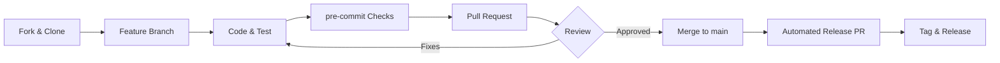

# Contributing to LinkForge

Thank you for your interest in contributing to LinkForge! This guide will help you get started.

## Table of Contents

- [Code of Conduct](#code-of-conduct)
- [Getting Started](#getting-started)
- [Development Setup](#development-setup)
- [Project Structure](#project-structure)
- [Development Workflow](#development-workflow)
- [Testing](#testing)
- [Code Style](#code-style)
- [Submitting Changes](#submitting-changes)
- [Release Process](#release-process)
- [Technical Considerations](#technical-considerations)
- [Maintainer Expectations](#maintainer-expectations)
- [Governance](#governance)
- [Getting Help](#getting-help)
- [Recognition](#recognition)

## Code of Conduct

Be respectful, inclusive, and professional. We're all here to build great robotics tools together.

## Getting Started

### Prerequisites

- **Python 3.11+**
- **Blender 4.2+**
- **Git**
- **just** (Command Runner)
  - **macOS**: `brew install just`
  - **Linux**: `sudo apt install just` (or via `snap` / `cargo`)
  - **Windows**: `choco install just` or `scoop install just`
  - **Universal**: `cargo install just` (requires Rust)
- **uv** (Python package manager) - Install: `curl -LsSf https://astral.sh/uv/install.sh | sh`

### Fork and Clone

```bash
# Fork the repository on GitHub, then:
git clone https://github.com/YOUR_USERNAME/linkforge.git
cd linkforge
```

## Development Setup

### 1. Install Dependencies

```bash
# Install everything (deps + pre-commit hooks)
just install
```

### 2. Verify Setup

```bash
# Run tests to verify everything works
just test

# Run linter
just lint

# Build extension
just build
```

## Project Structure

```
linkforge/
├── core/                  # Core Robotics Logic (pip package)
│   └── src/linkforge_core/
├── platforms/
│   └── blender/           # Blender Extension (.zip)
├── tests/                 # Test Suite (unit + integration)
├── examples/              # Example URDF/XACRO files
└── pyproject.toml         # Workspace config
```

See [ARCHITECTURE](https://linkforge.readthedocs.io/en/latest/explanation/ARCHITECTURE.html) for detailed architecture diagrams.

## Development Workflow



### 1. Create a Feature Branch

```bash
git checkout -b feature/your-feature-name
```

### 2. Make Changes

- Write code following our [Code Style](#code-style)
- Add tests for new functionality
- Update documentation as needed

### 3. Run Quality Checks

```bash
# Run all tests
just test

# Run linter and type checker
just check

# Fix linting issues automatically
just fix
```

### 4. Test in Blender

```bash
# Build extension
just build

# Install in Blender:
# 1. Open Blender
# 2. Edit > Preferences > Get Extensions
# 3. Dropdown (⌄) > Install from Disk
# 4. Select dist/linkforge-blender-x.x.x-macos_arm64.zip (or your platform variant)
```

### 5. Commit Changes

```bash
git add .
git commit -m "feat: add your feature description"
```

**Commit Message Format:**
- `feat:` New feature
- `fix:` Bug fix
- `docs:` Documentation changes
- `test:` Test additions/changes
- `refactor:` Code refactoring
- `perf:` Performance improvements
- `chore:` Maintenance tasks

## Testing

### Running Tests

LinkForge uses a **split-testing architecture** to maintain CI stability:

```bash
# 1. Run core tests (Standard Python)
just test-core

# 2. Run Blender integration tests (Requires Blender)
just test-blender
```

To run specific tests or categories:

```bash
# Run with coverage (Combined report)
just coverage

# Run specific core test file (manual)
uv run pytest tests/unit/core/test_robot.py

# Run specific Blender integration test file (manual)
uv run python run_blender_tests.py tests/integration/blender/test_roundtrip.py
```

### Manual QA (Mandatory)

For features involving UI, viewport transforms, or complex exports, automated tests are not enough. Contributors **must** follow and pass the [Manual QA Protocol](https://github.com/arounamounchili/linkforge/blob/main/docs/testing/manual_qa.md) before submitting a PR.

- **Objective**: Ensure export validity (URDF/XACRO standards), correct physics calculations, and UI stability across macOS, Windows, and Linux.
- **Protocol**: Follow the 7-Phase checklist in `docs/testing/manual_qa.md`.

### Writing Tests

#### Unit Test Example

```python
def test_link_creation():
    """Test creating a link with valid parameters."""
    link = Link(
        name="test_link",
        visuals=[],
        collisions=[],
        inertial=Inertial(mass=1.0, inertia=InertiaTensor(...))
    )
    assert link.name == "test_link"
    assert link.inertial.mass == 1.0
```

#### Round-Trip Test Example

```python
def test_sensor_roundtrip():
    """Test sensor origin survives import-export cycle."""
    # Create robot with sensor
    robot = Robot(
        name="test",
        links=[Link(...)],
        sensors=[Sensor(origin=Transform(xyz=(0.1, 0, 0.2)))]
    )

    # Export to URDF
    generator = URDFGenerator()
    urdf = generator.generate(robot)

    # Re-import
    from linkforge_core.parsers import URDFParser
    robot2 = URDFParser().parse_string(urdf)

    # Verify sensor origin preserved
    assert robot2.sensors[0].origin == robot.sensors[0].origin
```

- **Unit Tests** (`tests/unit/`): Test individual functions/classes in isolation (Core or Blender).
- **Integration Tests** (`tests/integration/`): Test full workflows and round-trips organized into `parsers/`, `blender/`, and `features/`.

> [!TIP]
> **Use Central Fixtures**: Always use the `examples_dir` fixture from `tests/conftest.py` when accessing example URDFs. Avoid hardcoding relative paths like `../../examples`.

### Testing Philosophy ("Real Data over Mocks")

We prioritize testing with **real objects and environments** over mocking.

1.  **Blender Tests**: Prefer real `bpy` objects and a headless Blender instance.
    - Use `bpy.ops.object.empty_add()` to create real objects in your test fixtures.
    - **Mock only when necessary**: GPU internals (`gpu.shader`, `gpu.matrix`), addon preferences in non-Blender pytest, and I/O error paths.
    - **Avoid**: Mocking `bpy.types`, Blender data structures, or "dummy" property classes for happy-path tests.

2.  **Core Tests**: Use real data models.
    - Instantiate real `Robot`, `Link`, or `Joint` objects.
    - **Mock only for edge cases**: Missing optional dependencies, filesystem failures, or states that can't be constructed through normal validation.

### Debugging in Blender

```python
import logging
logger = logging.getLogger(__name__)
logger.error(f"Debug: {variable}")

# View in Blender Console (Window > Toggle System Console)
```

## Code Style

### Python Style Guide

We follow **PEP 8** with some modifications. Always use **type hints** and **Google-style docstrings** (required for ReadTheDocs API docs):

```python
# Good: Clear, typed, documented
def calculate_inertia(geometry: Box, mass: float) -> InertiaTensor:
    """Calculate inertia tensor for a box.

    Args:
        geometry: Box geometry with dimensions
        mass: Total mass in kg

    Returns:
        Inertia tensor for the box

    Raises:
        ValueError: If mass is non-positive
    """
    if mass <= 0:
        raise ValueError("Mass must be positive")

    # Calculate moments of inertia
    ixx = (mass / 12.0) * (geometry.size.y**2 + geometry.size.z**2)
    # ...
    return InertiaTensor(ixx=ixx, ...)
```

```python
# Good ✅
def parse_float(text: str | None, default: float | None = None) -> float:
    ...

# Bad ❌
def parse_float(text, default=None):
    ...
```

### Linting Configuration

Our `ruff` configuration (in `pyproject.toml`):

```toml
[tool.ruff]
line-length = 100
target-version = "py311"

[tool.ruff.lint]
select = ["E", "F", "I", "N", "UP", "B", "A", "C4", "SIM"]
ignore = ["E501", "N801"]  # Line length (formatter) & naming convention
```

### Pre-commit Hooks

Pre-commit automatically runs on `git commit`:

- `ruff check` - Linting (with auto-fix)
- `ruff format` - Code formatting
- `conventional-pre-commit` - Enforces conventional commit messages
- `codespell` - Catches common typos in code and docs
- Standard file checks - trailing whitespace, EOF newline, YAML/TOML/JSON validation, large files, merge conflicts, etc.

## Submitting Changes

### Pull Request Process

1. **Push your branch**
   ```bash
   git push origin feature/your-feature-name
   ```

2. **Create Pull Request**
   - Go to GitHub and create a PR
   - Fill out the PR template
   - Link any related issues

3. **Check Pull Request Status**
   - Ensure the CI pipeline passes (GitHub Actions).
   - Once you create the PR, follow the automated checklist provided in the PR description template. This ensures all standards (tests, linting, quality) are met before maintainer review.

4. **Code Review**
   - Address review comments
   - Keep commits clean and logical
   - Squash commits if requested

5. **Merge**
   - Maintainer will merge once approved
   - Your contribution will be in the next release!

### PR Title Format

Use conventional commits:

- `feat: Add support for new sensor type`
- `fix: Correct sensor origin export`
- `docs: Update architecture diagrams`
- `test: Add round-trip tests for transmissions`

## Release Process

LinkForge uses **Release Please** to automate versioning and changelogs.

1. **Automation**: When code is merged into `main`, Release Please will automatically create (or update) a "Release PR".
2. **Versioning**: This PR will contain a version bump in `blender_manifest.toml`, `CITATION.cff`, and an updated `CHANGELOG.md` based on your commit messages.
3. **Merging**: Once a maintainer merges this Release PR, a GitHub Tag and Release are automatically created.
4. **Distribution**: The `release-please.yml` workflow will then build the extension `.zip` and attach it to the GitHub Release.

### Release Standards

To maintain a professional and consistent appearance:
- **Tagging**: Always use simple `v` prefixed tags (e.g., `v1.2.0`). This is handled automatically by the configuration.
- **Release Titles**: Follow the format `v1.x.x: [Major Highlight]`. For example: `v1.2.0: Enhanced Sensor Suite & UI Refinement`.
- **Changelog**: Use the project's custom sections (🚀 Features, 🐞 Bug Fixes, etc.) to keep notes organized.

> [!NOTE]
> This is why **Conventional Commits** are required. Without them, the release automation cannot determine if a change should bump the MAJOR, MINOR, or PATCH version.

## Technical Considerations

To maintain LinkForge's status as a professional-grade tool, we prioritize stability in three key areas:

### 1. The Blender Bridge (Foundation)
LinkForge must remain compatible with the latest Blender LTS (Long Term Support) and the current stable release.
- **Vigilance**: When a new Blender version (e.g., 5.0) enters Beta, we prioritize testing our `export_ops.py` to ensure no API breaking changes affect our users.

### 2. URDF/XACRO Fidelity (Core)
Our primary goal is 100% compliance with official specifications.
- **Cross-Simulator Support**: We ensure that generated files work seamlessly across Gazebo (Classic & Sim), Webots, Isaac Sim, and MuJoCo.
- **Precision**: Physics calculations (inertia tensors) must remain scientifically accurate, as they are the "brain" of the exported robot.

### 3. The ROS 2 Ecosystem (Integration)
While LinkForge supports `ros2_control`, it is designed to be distribution-agnostic where possible.
- **Compatibility**: We target compatibility with active ROS 2 LTS distributions (like Humble and Jazzy) and Rolling.
- **Maintenance**: If the official `ros2_control` XML syntax changes in a newer ROS version, we update our generators to support those changes while maintaining backward compatibility.

## Maintainer Expectations

As a maintainer-driven project, we aim to be transparent about our availability and response times:

- **Review Cycle**: Expect an initial response or feedback on PRs within **7 business days**.
- **Issue Triage**: New issues are usually triaged during our weekly maintenance window (typically weekends).
- **Public Communication**: We prefer all discussions to happen in public issues or GitHub Discussions to ensure the community benefits from the shared knowledge.
- **Decision Making**: For major architectural changes, we follow a consensus-based approach among core maintainers. If you are proposing a large change, please open a Discussion first to get early feedback.

## Governance

LinkForge is currently maintained by @arounamounchili and the community.

- **Core Maintainers**: Responsible for architectural oversight and final merging.
- **Contributors**: Anyone who submits code, documentation, or feedback.
- **Recognition**: We follow the [All Contributors](https://allcontributors.org/) specification to recognize all types of contributions.

## Getting Help

- **Documentation**: Check the [Official Documentation](https://linkforge.readthedocs.io/) and [Architecture Guide](https://linkforge.readthedocs.io/en/latest/explanation/ARCHITECTURE.html)
- **Issues**: Search [existing issues](https://github.com/arounamounchili/linkforge/issues)
- **Discussions**: Ask in [GitHub Discussions](https://github.com/arounamounchili/linkforge/discussions)

## Recognition

We value every contribution! To keep things simple for maintainers, **contributor recognition is fully automated**:

- **`README.md`**: Handled by the `@all-contributors` bot.
- **`CHANGELOG.md` & Release Notes**: Automated via `release-please` based on commit messages.
- **GitHub Contributors**: Managed automatically by GitHub's platform.

### 🤖 All Contributors Bot

We use the [@all-contributors](https://allcontributors.org/) bot to automatically recognize all types of contributions.

**How to get recognized:**
If you've contributed (code, docs, ideas, etc.), you can ask the bot to add you by commenting on an issue or pull request:

```text
@all-contributors please add @username for <contribution-type>
```

Replace `<contribution-type>` with one of the [valid contribution types](https://allcontributors.org/docs/en/emoji-key) (e.g., `code`, `doc`, `bug`, etc.).

### Academic Recognition
For significant core contributions (new sensor systems, physics engine refinements, major architectural changes), we may invite you to be listed as a co-author in the `CITATION.cff` file and the official documentation, ensuring your work is properly attributed in academic research using LinkForge.

Thank you for contributing to LinkForge! 🚀
