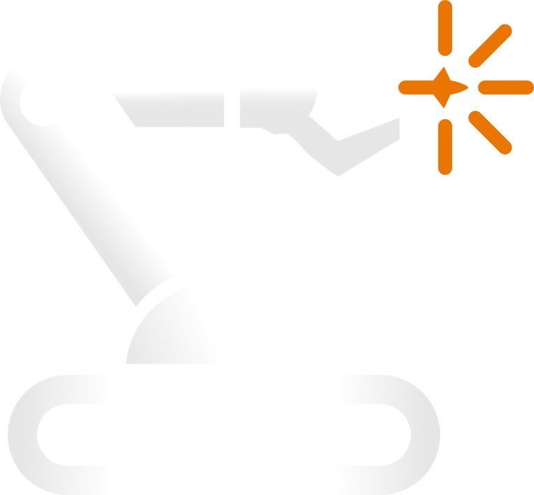

<div align="center">
  
</div>

# LinkForge
**Professional URDF & XACRO Exporter for Blender**

[](https://github.com/arounamounchili/linkforge/actions)
[](https://linkforge.readthedocs.io/)
[](https://www.gnu.org/licenses/gpl-3.0)
[](https://www.blender.org/download/)
[](https://www.python.org/)

LinkForge is a professional Blender extension for roboticists.

**In robotics, creativity starts in your head — but getting that idea into a simulator usually means hours of writing XML, fixing joint limits, and fighting coordinate systems.**

LinkForge removes that friction. Model your robot in Blender as naturally as sculpting a 3D scene, then let LinkForge handle the engineering:

1.  **Forge Structure**: Define links, joints, masses, and inertias visually.
2.  **Perceive Environment**: Attach sensors like LiDAR, IMU, and Depth Cameras.
3.  **Control Movement**: Configure transmissions and `ros2_control` interfaces.
4.  **Export Production Code**: Generate clean, validated URDF/XACRO files.

**From idea → robot → ready for simulation.** All inside Blender.

## 🚀 Key Features

- **Bidirectional Workflow**: Seamlessly import existing URDF/XACRO files for editing or build complex robot models from scratch using Blender's native tools.
- **Production-Ready Export**: Generates strictly compliant URDF/XACRO files optimized for ROS, ROS 2, and Gazebo. Output is clean, validated, and requires no manual post-processing.
- **Smart Validation**: Built-in integrity checker inspects robot topology, physics data, and joint limits to prevent common simulation crashes before they happen.
- **ROS2 Control Support**: Automatically generates hardware interface configurations for `ros2_control`, compatible with Gazebo, Webots, Isaac Sim, and physical hardware.
- **Complete Sensor Suite**: Integrated support for Camera, Depth Camera, LiDAR, IMU, GPS, and Force/Torque sensors with configurable noise models.
- **Automatic Physics**: Scientifically accurate calculation of mass properties and inertia tensors for both primitive shapes and complex arbitrary meshes.
- **Advanced XACRO Support**: Intelligent extraction of repeated geometry into macros and shared materials, producing maintainable and modular code.
- **Round-Trip Fidelity**: Import → Edit → Export cycle preserves all data absolute precision, including sensor origins, transmission interfaces, and custom user properties.

## 📦 Installation

**Requirements**: Blender 4.2 or later

### Method 1: Blender Extensions (Recommended)
1. Open Blender → **Edit > Preferences > Get Extensions**
2. Search for **"LinkForge"**
3. Click **Install**

### Method 2: Manual Installation
1. Download `linkforge-1.0.0.zip` from [Releases](https://github.com/arounamounchili/linkforge/releases)
2. Open Blender → **Edit > Preferences > Get Extensions**
3. Click dropdown (⌄) → **Install from Disk**
4. Select the downloaded `.zip` file

## 🎯 Quick Start

### Creating a Robot from Scratch

1. **Create Links**
   - Select a mesh → LinkForge panel → **Create Link**
   - Configure mass, inertia, and collision geometry
   - Repeat for all robot parts

2. **Connect with Joints**
   - Select child link → **Create Joint**
   - Choose joint type (Revolute, Prismatic, Continuous, Fixed)
   - Set limits, axis, and dynamics

3. **Add Sensors** (Optional)
   - Select a link → **Add Sensor**
   - Configure sensor type, update rate, and noise parameters

4. **Configure Control** (Optional)
   - Select a joint → **Create Transmission**
   - Configure hardware interfaces (Position, Velocity, or Effort)

5. **Validate & Export**
   - Click **Validate Robot** to check for errors
   - Choose format (URDF/XACRO)
   - Click **Export** → Done!

### Importing Existing URDF

1. **File > Import > URDF (.urdf)**
2. Select your URDF file
3. Edit in Blender
4. Export back to URDF/XACRO

## 🛠️ Workflow

LinkForge follows a structured **Forge → Perceive → Control → Export** workflow:

### 1. Forge Links
- Convert meshes to robot links with automatic naming
- Generate optimized collision geometry
- Calculate physics properties (mass, inertia)
- Reversible actions (safely remove links)

### 2. Forge Joints
- Connect links with precise joint configuration
- Visual feedback for joint axes in viewport
- Full CRUD operations (Create, Read, Update, Delete)
- Support for all URDF joint types

### 3. Perceive (Sensors)
- Attach sensors to links
- Configure update rates, resolutions, noise models
- Gazebo plugin integration

### 4. Control (Transmissions)
- Configure hardware interfaces (Position, Velocity, Effort)
- Set up mechanical reductions and joint limits
- Auto-generate `ros2_control` tags

### 5. Validate & Export
- Built-in validator catches common errors
- Export to URDF or XACRO with mesh handling

## 📚 Examples

Complete examples in `examples/` directory:

- `roundtrip_test_robot.urdf`: A comprehensive robot containing ALL 6 URDF joint types (fixed, revolute, continuous, prismatic, planar, floating), plus sensors and transmissions. Perfect for testing full roundtrip capabilities.
- `mobile_robot.urdf`: A simple mobile robot base.
- `diff_drive_robot.urdf`: A differential drive robot with wheels.
- `quadruped_robot.urdf`: A 4-legged robot demonstrating complex kinematic chains and multi-link assemblies.


## 🎓 Documentation

- **[User Guide](https://linkforge.readthedocs.io/en/latest/tutorials/building_diff_drive.html)** - Getting started and usage instructions
- **[API Reference](https://linkforge.readthedocs.io/en/latest/reference/api/index.html)** - Programmatic usage
- **Examples**: [examples/](https://github.com/arounamounchili/linkforge/tree/main/examples)

## 💻 Development

### Setup
```bash
# Clone repository
git clone https://github.com/arounamounchili/linkforge.git
cd linkforge

# Install dependencies
uv sync
```

### Testing
```bash
# Run all tests
uv run pytest

# Run with coverage
uv run pytest --cov=linkforge --cov-report=html
```

### Code Quality
```bash
# Format code
uv run ruff format .

# Lint code
uv run ruff check .

# Type check
uv run mypy linkforge

# Install pre-commit hooks
uv run pre-commit install
```

### Building & Distribution
To package LinkForge as a Blender extension:
```bash
# General build (automatic wheel bundling)
python3 build_extension.py

# Sync dependencies (update wheels for all platforms)
python3 build_extension.py sync
```
The package will be created in the `dist/` directory.

### Managing Dependencies
LinkForge uses a "Self-Contained" bundling strategy for wheels. To update or add new dependencies:
1. Open `build_extension.py` and update the `DEP_CONFIG` dictionary.
2. Run `python3 build_extension.py sync` to download wheels for Windows, Linux, and Mac (Python 3.10 & 3.11).

## 📚 Documentation

- **[Read the Docs](https://linkforge.readthedocs.io/)** - Complete documentation
- **[Architecture Guide](https://linkforge.readthedocs.io/en/latest/explanation/ARCHITECTURE.html)** - System design with diagrams
- **[API Reference](https://linkforge.readthedocs.io/en/latest/reference/api/)** - Programmatic usage
- **[Getting Started](https://linkforge.readthedocs.io/en/latest/tutorials/index.html)** - User guide
- **[CHANGELOG](CHANGELOG.md)** - Version history

## 🎓 Learning Resources

- [Example Files](https://github.com/arounamounchili/linkforge/tree/main/examples) - Sample URDF files
- [Community Forum](https://github.com/arounamounchili/linkforge/discussions) - Ask questions

## 🤝 Contributing

We welcome contributions! Please see our [Contributing Guide](CONTRIBUTING.md) for details.

### Quick Start for Contributors

```bash
# Clone repository
git clone https://github.com/arounamounchili/linkforge.git
cd linkforge

# Install dependencies
uv sync

# Run tests
uv run pytest

# Build extension
python3 build_extension.py
```

## 📄 License

This project is licensed under the GNU General Public License v3.0 - see the [LICENSE](LICENSE) file for details.

## 🙏 Acknowledgments

- ROS and Gazebo communities for URDF/XACRO standards
- Blender Foundation for the amazing 3D software


## 📞 Support

- **Issues**: [GitHub Issues](https://github.com/arounamounchili/linkforge/issues)
- **Discussions**: [GitHub Discussions](https://github.com/arounamounchili/linkforge/discussions)

---

**Made with ❤️ for roboticists worldwide**
