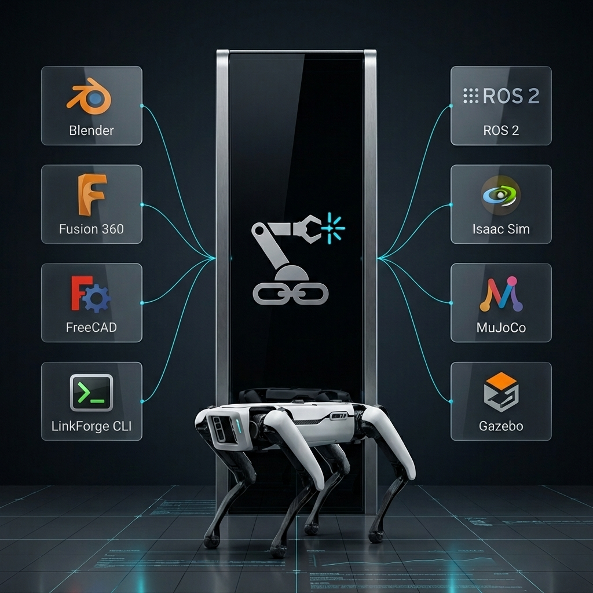

# LinkForge: The Missing Link in Robotics

## 🎯 Our Mission
To bridge the fundamental gap between creative 3D design and high-fidelity robotics engineering. We empower roboticists to build, validate, and deploy their "Digital Twins" from a single source of truth.

## 🎓 Who Uses LinkForge?

*   **Students & Researchers**: Learning ROS 2 and publishing reproducible robot designs with free, open-source tools
*   **Indie Robotics Startups**: Building prototypes and MVPs without expensive CAD licenses
*   **Open-Source Community**: Creating and sharing robot designs for competitions, education, and collaboration
*   **Academic Labs**: Developing novel robots with precise physics for simulation-based research

---

## 🌉 The Universal Robotics Bridge
There is a fundamental "impedance mismatch" in the modern robotics workflow. LinkForge exists to eliminate it.

### The Problem: A Language Barrier
*   **Design Software** speaks in *meshes, assemblies, aesthetics, and geometric constraints.*
*   **Robotics Ecosystems** require **Physics Primitives** (analytical links, joint topologies, exact inertia tensors) and **Integration Targets** (middleware like ROS 2/ros2_control or physics engines like MuJoCo/MJCF and Gazebo/SDF).

### The Solution: LinkForge
LinkForge is not just an exporter; it is a **Universal Interoperability Platform**. It acts as the high-fidelity translator that ensures your design intent is mathematically preserved across the entire development lifecycle:

**Design Systems** (Blender, FreeCAD, Fusion 360) ➜ **LinkForge Core** ➜ **Simulation & Production** (ROS 2, MuJoCo, Isaac Sim, Real Hardware)

---

## 🔭 The "Digital Twin" North Star
We believe a simulator should never be "close enough." It should be identical. Our North Star is the perfect **Digital Twin**:
*   **Numerical Integrity**: Every mass calculation and inertia tensor is scientifically grounded, guaranteed by a core that prioritizes physics over approximations.
*   **Design-Time Validation**: Catch mechanical conflicts and kinematic errors *during* the design phase—reducing simulation failures and hardware rework.

---

## 💎 The LinkForge Competitive Edge
Why LinkForge is the choice for the next generation of robotics:

| Feature | Legacy Exporters | LinkForge Platform |
| :--- | :--- | :--- |
| **Architecture** | Monolithic / Tied to one CAD tool | **Hexagonal / Multi-Host & Multi-Target** |
| **Validation** | Post-Export (Fail in Sim) | **Design-Time (Fail in Editor)** |
| **Physics** | "Close Enough" Mesh Export | **Scientific Inertia & Mass Sanity** |
| **Complexity** | Manual Axis/Joint Setup | **AI-Assisted Topology Inference** |
| **MetaData** | Geometry only | **Sim-to-Real "Noise" & Expert Data** |

---

## 🏗️ Technical Strategy: The Hexagonal Core
LinkForge is engineered for the future. By utilizing a **Hexagonal Architecture (Ports & Adapters)**, we remain framework-independent:
*   **Decoupled Intelligence**: Our "Robotics Brain" is isolated from the 3D host (Blender/FreeCAD/Fusion 360).
*   **Model Once, Deploy Anywhere**: Swappable adapters allow a single robot model to target multiple simulators (MJCF, URDF, SDF) without losing precision.
*   **Scalable Adaptation**: As new tools emerge, LinkForge is ready to bridge them without rewriting the fundamental physics core.

---

## 🚀 Future Horizons
We are building the infrastructure for the next generation of autonomy:
*   **🛡️ Kinematic Intelligence**: Built-in solvers to validate workspace reachability and mechanical interference inside the visual editor.
*   **🧠 Intelligence-Driven Rigging**: Leveraging geometric analysis to automate joint and sensor placement based on mesh topology.
*   **🌊 High-Fidelity Noise Injection**: Modeling real-world sensor imperfections (drift, jitter, bias) to close the Sim-to-Real gap.

---

> [!IMPORTANT]
> **LinkForge** is built for developers who know that in robotics, **Physics is Truth**. We provide the infrastructure; you build the future.
