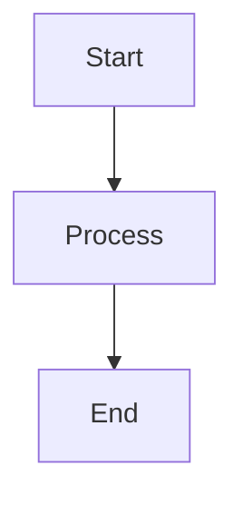

# LinkForge Documentation

This directory contains the Sphinx documentation for LinkForge.

## Building the Documentation

### Prerequisites

```bash
# Install documentation dependencies
uv sync
```

### Build HTML Documentation

```bash
cd docs
uv run sphinx-build -b html source build/html
```

Or use the Makefile:

```bash
cd docs
make html
```

### View Documentation

Open `build/html/index.html` in your browser:

```bash
# macOS
open build/html/index.html

# Linux
xdg-open build/html/index.html

# Windows
start build/html/index.html
```

## Documentation Structure

```
docs/
├── source/
│   ├── index.md              # Main page
│   ├── tutorials/            # Step-by-step guides for beginners
│   ├── how_to/               # Problem-oriented guides and recipes
│   ├── reference/            # API reference and technical specifications
│   ├── explanation/          # Background context and architectural overviews
│   ├── conf.py               # Sphinx configuration
│   └── _static/              # Static files (CSS, images)
├── build/                    # Generated documentation (git-ignored)
├── Makefile                  # Build automation
└── README.md                 # This file
```

## Writing Documentation

### Markdown Files

Documentation is written in Markdown with MyST parser extensions:

```markdown
# Page Title

Regular markdown content.

## Code Examples

\`\`\`python
from linkforge_core.models import Robot

robot = Robot(name="my_robot")
\`\`\`

## Cross-References

See [Getting Started](getting_started.md) for more info.
```

### API Documentation

API docs use Sphinx autodoc with reStructuredText:

````markdown
# Module Name

```{eval-rst}
.. autoclass:: linkforge_core.models.Robot
   :members:
   :undoc-members:
   :show-inheritance:
```
````

### Mermaid Diagrams

Architecture diagrams use Mermaid syntax:

````markdown

````

## Publishing

### Local Build and Release

```bash
# Build docs
cd docs
make html

# Copy to gh-pages branch (if maintaining GitHub pages manually)
git checkout gh-pages
cp -r build/html/* .
git add .
git commit -s -m "Update documentation"
git push origin gh-pages
```

## Configuration

### Sphinx Settings (`source/conf.py`)

- **Theme**: Read the Docs theme
- **Extensions**: autodoc, Napoleon, viewcode, intersphinx
- **Type Hints**: Automatic type hint documentation
- **MyST**: Markdown support with extensions

### Customization

- **Theme**: Edit `html_theme` in `conf.py`
- **CSS**: Add custom CSS to `source/_static/`
- **Templates**: Override templates in `source/_templates/`

## Troubleshooting

### "Module not found" errors

Ensure the package is installed:

```bash
uv sync
```

### "Linkify not installed" error

Linkify extension is disabled in `conf.py`. If you need it:

```bash
uv add --dev linkify-it-py
```

### Broken cross-references

Use relative paths for local files:

```markdown
See [Architecture](ARCHITECTURE.md) for details.
```

### Build warnings

Review warnings in build output and fix:

```bash
cd docs
make html 2>&1 | grep WARNING
```

## Maintenance

### Updating API Docs

API docs auto-generate from docstrings. To update:

1. Update docstrings in source code
2. Rebuild documentation

### Adding New Pages

1. Create `.md` file in `source/`
2. Add to `toctree` in `index.md` or relevant parent page
3. Rebuild

### Versioning

For versioned docs, use sphinx-multiversion:

```bash
uv add --dev sphinx-multiversion
```

## Resources

- [Sphinx Documentation](https://www.sphinx-doc.org/en/master/)
- [MyST Parser](https://myst-parser.readthedocs.io/en/latest/)
- [Read the Docs Theme](https://sphinx-rtd-theme.readthedocs.io/en/stable/)
- [Mermaid Diagrams](https://mermaid.js.org/)
