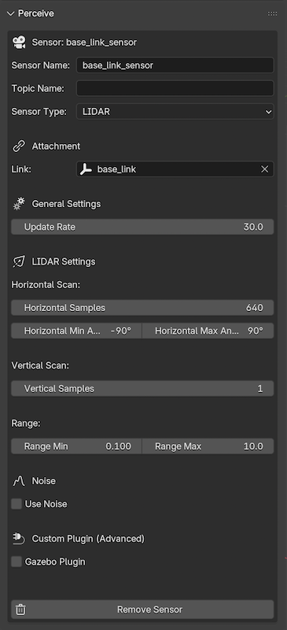

# How-to: Add Sensors to Your Robot

This guide shows you how to integrate sensors like LiDAR, Cameras, and IMUs into your LinkForge robot model for simulation.

## Prerequisites
- A robot model with at least one **Link** created.

## 1. Prepare the Sensor Link
A sensor in URDF is usually attached to a specific link. You can either attach it to an existing link (like `base_link`) or create a dedicated small mesh to represent the sensor body.

## 2. Attaching the Sensor
1. Select the link that should hold the sensor in the 3D Viewport.
2. Open the **LinkForge** panel and navigate to the **Perceive** tab.
3. Click **Add Sensor**.

## 3. Configuration
Once added, you can configure the sensor properties:
- **Update Rate**: How many times per second the sensor scans (e.g., 30Hz).
- **Topics**: The ROS topic name where data will be published.
- **Noise Models**: Add Gaussian noise to simulate real-world sensor inaccuracies.

### Common Sensor Types:
- **LIDAR**: Select `LIDAR` in the dropdown (exports as `<gpu_lidar>`). Requires `<ray>` configuration for samples and range.
- **Camera**: Requires resolution and focal length settings.
- **IMU**: Provides orientation and acceleration data.

## 4. Gazebo Integration
LinkForge automatically generates the necessary `<gazebo>` tags and plugins to make these sensors work instantly in **Gazebo Sim** or **Gazebo Classic**.

::: {admonition} Note
:class: note
Sensor origins in LinkForge are relative to the link they are attached to. Ensure your visual mesh in Blender aligns with where you want the "data origin" to be.
:::
