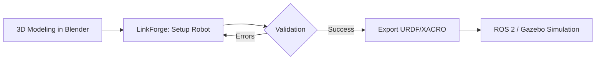

# LinkForge Documentation

Welcome to the official LinkForge documentation. LinkForge is a professional Blender extension designed to bridge the gap between 3D modeling and robotics simulation.

## 🔄 Workflow at a Glance



---

## 🚀 Key Features

LinkForge removes the friction from robotics modeling:

- **Bidirectional Workflow**: Import existing URDF/XACRO files or build from scratch.
- **Production-Ready Export**: Strictly compliant URDF/XACRO files optimized for ROS/Gazebo.
- **Smart Validation**: Built-in integrity checker for robot topology and physics.
- **ROS2 Control Support**: Automatic hardware interface configuration.
- **Complete Sensor Suite**: Integrated support for LiDAR, IMU, Depth Cameras, and more.
- **Automatic Physics**: Mass properties and inertia tensor calculation.

---

## 📦 Installation

**Requirements**: Blender 4.2 or later

1.  Open Blender → **Edit > Preferences > Get Extensions**
2.  Search for **"LinkForge"**
3.  Click **Install**

---

## 🎯 Quick Start

1.  **Create Links**: Select a mesh and click **Create Link** in the LinkForge panel.
2.  **Connect Joints**: Select child link and click **Create Joint**.
3.  **Add Sensors**: Attach cameras or LiDARs to your links.
4.  **Validate & Export**: Run the validator and export to URDF or XACRO.

---

::::{grid} 2
:gutter: 3

:::{grid-item-card} 🚀 Tutorials
:link: tutorials/index
:link-type: doc

**Learning-oriented.** Start here if you are new to LinkForge. Step-by-step lessons to build your first robot.
^^^
- [Building a Diff-Drive Robot](tutorials/building_diff_drive)
:::

:::{grid-item-card} 🛠️ How-to Guides
:link: how_to/index
:link-type: doc

**Task-oriented.** Practical guides to help you achieve specific goals or solve problems.
^^^
- [Adding Sensors](how_to/add_sensors)
- [Defining Joints](how_to/index)
:::

:::{grid-item-card} 💡 Explanation
:link: explanation/index
:link-type: doc

**Understanding-oriented.** Deep dives into the architecture, theory, and design of LinkForge.
^^^
- [Architecture Guide](explanation/ARCHITECTURE)
- [Data Model](explanation/data_model)
:::

:::{grid-item-card} 📚 Reference
:link: reference/index
:link-type: doc

**Information-oriented.** Technical descriptions, API documentation, and specifications.
^^^
- [Python API Reference](reference/api/index)
- [URDF Specification](reference/index)
:::

::::

---

```{toctree}
:maxdepth: 2
:hidden:
:caption: Tutorials

tutorials/index
```

```{toctree}
:maxdepth: 2
:hidden:
:caption: How-to Guides

how_to/index
```

```{toctree}
:maxdepth: 2
:hidden:
:caption: Explanation

explanation/index
```

```{toctree}
:maxdepth: 2
:hidden:
:caption: Reference

reference/index
CHANGELOG
CONTRIBUTING
README
LICENSE
```

---

> [!NOTE]
> **Scientific Accuracy**: LinkForge is built for precision. All inertia calculations use solid-body dynamics formulas to ensure simulation fidelity.

## 👥 Community & Support

- **Found a bug?** Open an issue on our [GitHub Issue Tracker](https://github.com/arounamounchili/linkforge/issues).
- **Have a question?** Join the discussion on [GitHub Discussions](https://github.com/arounamounchili/linkforge/discussions).
- **Want to contribute?** We love PRs! Read our [Contributing Guide](CONTRIBUTING).

## Quick Links

- [GitHub Repository](https://github.com/arounamounchili/linkforge)
- [Issue Tracker](https://github.com/arounamounchili/linkforge/issues)
- [Discussions](https://github.com/arounamounchili/linkforge/discussions)
