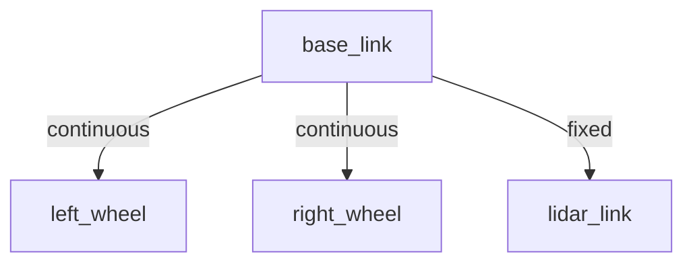
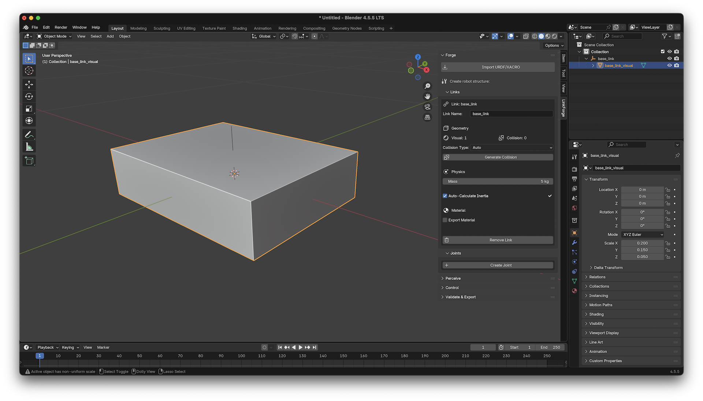
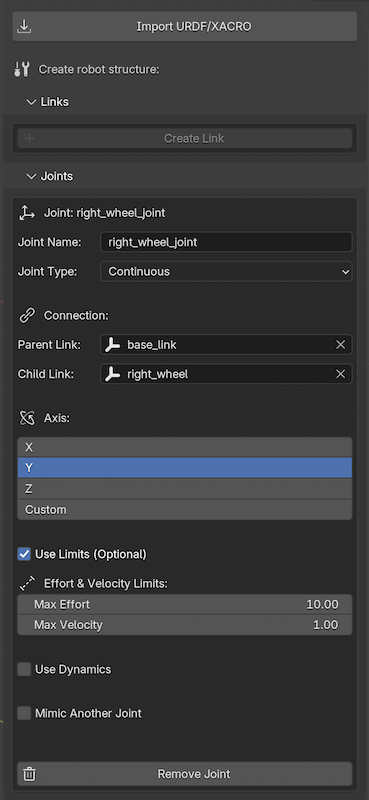
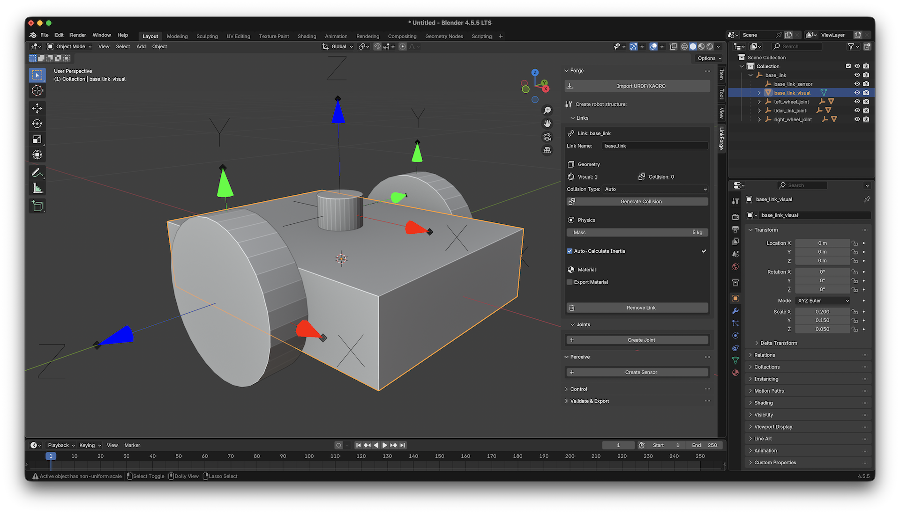

# Tutorial: Building a Differential Drive Robot

In this tutorial, you will learn how to build a fully functional differential drive mobile robot from scratch in Blender and export it as a URDF for use in ROS 2 or Gazebo.

## What You Will Learn
- How to create and configure **Links**.
- How to connect links with **Joints**.
- How to add a **Lidar Sensor**.
- How to **Validate** and **Export** your robot.

## 🌳 Kinematic Tree

Before we start building, here is the structure of the robot we are going to create:

---

## Step 1: Create the Base Link

1. **Add a Mesh**: In Blender, press `Shift + A` and select **Mesh > Cube**. 
2. **Scale the Base**: Set the dimensions to roughly `0.4m x 0.3m x 0.1m`.
3. **Forge the Link**:
   - Open the **LinkForge** panel in the Sidebar (`N` key).
   - With the cube selected, click **Create Link**.
   - Name it `base_link`.
   - Set **Mass** to `5.0` kg.
   - Enable **Auto-Calculate Inertia** (LinkForge will automatically generate the inertia tensor for the box).

::: {admonition} Tip
:class: tip
Always keep LinkForge's **Auto-Calculate Inertia** checkbox enabled rather than entering values manually. It ensures the physical consistency required by simulation engines like Gazebo.
:::

## Step 2: Create the Wheels

1. **Add a Cylinder**: `Shift + A` > **Mesh > Cylinder**.
2. **Dimensions**: Set Radius to `0.1m` and Depth to `0.05m`.
3. **Rotate**: Rotate it 90 degrees on the X-axis so it looks like a wheel.
4. **Duplicate**: Press `Shift + D` and move the new cylinder to the other side. You now have two generic cylinder meshes.

### Forge the Left Wheel
1. Select the first cylinder.
2. Click **Create Link**.
3. Name it `left_wheel`.
4. Set **Mass** to `0.5` kg.

### Forge the Right Wheel
1. Select the second cylinder.
2. Click **Create Link**.
3. Name it `right_wheel`.
4. Set **Mass** to `0.5` kg.

## Step 3: Connect with Joints

1. **Connect Left Wheel**:
   - Select `left_wheel`.
   - In the LinkForge panel, go to the **Joints** tab and click **Create Joint**.
   - **Type**: Select `continuous` (wheels don't have limits).
   - **Parent**: Select `base_link`.
   - **Axis**: Set to `(0, 1, 0)` if your wheel rotates around the Y-axis.

2. **Connect Right Wheel**:
   - Repeat the process for `right_wheel`, connecting it to `base_link`.

## Step 4: Add a Lidar Sensor

1. **Create Lidar Mesh**: Add a small cylinder on top of the base.
2. **Create Link**: Call it `lidar_link`.
3. **Create Fixed Joint**: Connect `lidar_link` to `base_link` using a `fixed` joint type.
4. **Attach Sensor**:
   - Go to the **Perceive** tab in LinkForge (often referred to as the Sensors panel).
   - With `lidar_link` selected, click **Add Sensor**.
   - Select **Type**: `LIDAR` (LinkForge exports this as `gpu_lidar` for modern Gazebo).
   - Set **Update Rate** to `30` Hz.

## Step 5: Validate and Export

1. **Validate**: In the LinkForge **Robot** tab, click **Validate Robot**.
   - LinkForge will check if all links are connected and if physics data is valid.

::: {admonition} Warning
:class: warning
Exporting without validation may result in a URDF that causes simulators to crash or behave erratically. Fix all red markers before proceeding.
:::
2. **Export**: 
   - Go to the **Export** tab.
   - Select **Format**: `URDF`.
   - Click **Export URDF** and choose a location.

---

### 🎉 Success!
You now have a production-ready URDF file. You can now load this file into **Gazebo** or use it with a **ROS 2** robot state publisher.
