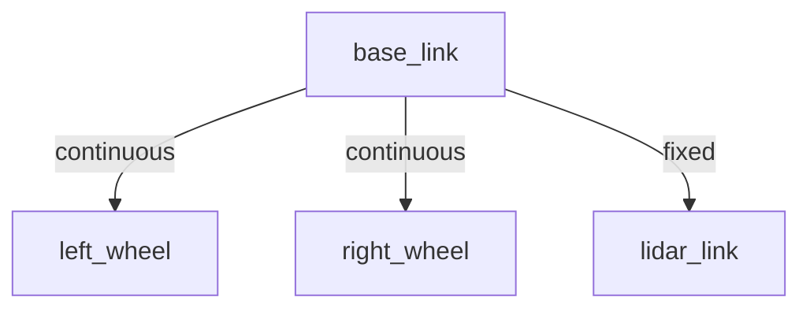
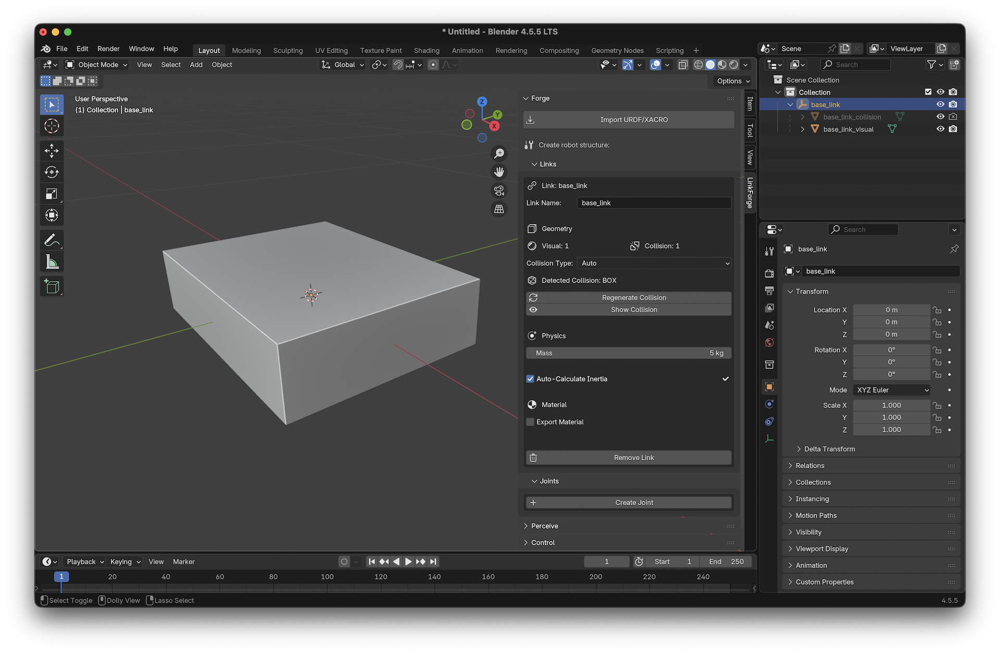
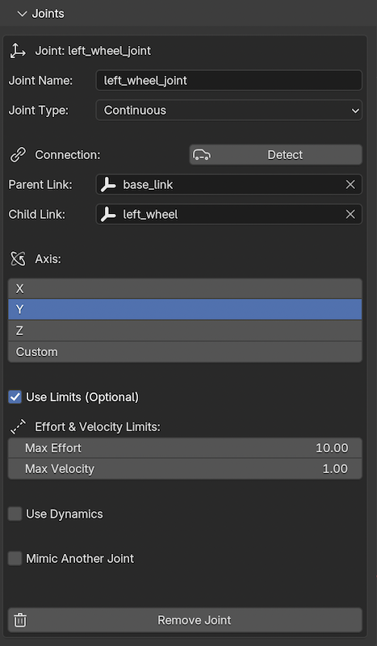
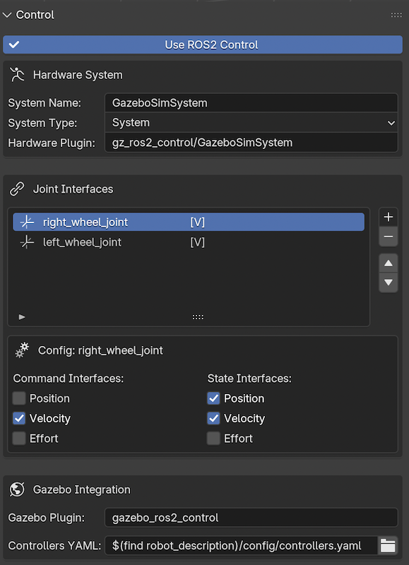
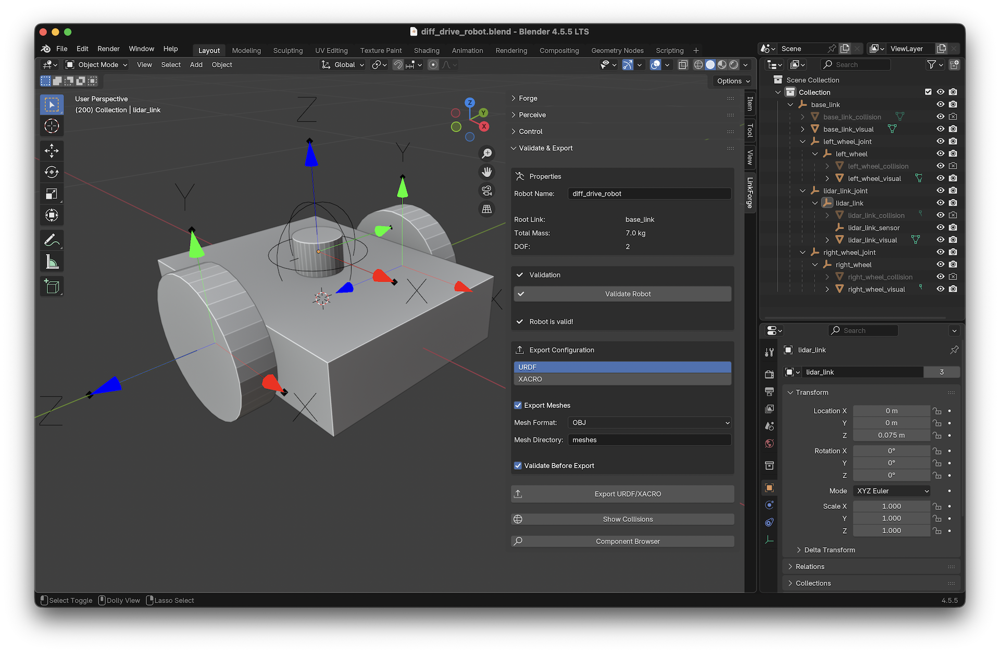

# Tutorial: Building a Differential Drive Robot

In this tutorial, you will learn how to build a fully functional differential drive mobile robot from scratch in Blender and export it as a URDF for use in ROS 2 or Gazebo.

## What You Will Learn
- How to create and configure **Links**.
- How to connect links with **Joints**.
- How to add a **Lidar Sensor**.
- How to configure **Control Interfaces**.
- How to **Validate** and **Export** your robot.

## 🌳 Kinematic Tree

Before we start building, here is the structure of the robot we are going to create:



---

## Step 1: Create the Base Link

1. **Add a Mesh**: In Blender, press `Shift + A` and select **Mesh > Cube**.
2. **Scale the Base**: Set the dimensions to roughly `0.4m x 0.3m x 0.1m`.
3. **Forge the Link**:
   - Open the **Links** panel in the LinkForge sidebar (`N` key).
   - With the cube selected, click **Create Link**.
   - Name it `base_link`.
   - Set **Mass** to `5.0` kg.
   - Enable **Auto-Calculate Inertia** (LinkForge will automatically generate the inertia tensor for the box).
   - **Generate Collision**: Click **Generate Collision**. LinkForge will create an optimized bounding box for the cube.



::: {admonition} Tip
:class: tip
Always keep LinkForge's **Auto-Calculate Inertia** checkbox enabled rather than entering values manually. It ensures the physical consistency required by simulation engines like Gazebo.
:::

## Step 2: Create the Wheels

1. **Add a Cylinder**: `Shift + A` > **Mesh > Cylinder**.
2. **Dimensions**: Set Radius to `0.1m` and Depth to `0.05m`.
3. **Rotate**: Rotate it 90 degrees on the X-axis so it looks like a wheel.
4. **Duplicate**: Press `Shift + D` and move the new cylinder to the other side. You now have two generic cylinder meshes.

### Forge the Left Wheel
1. Select the first cylinder.
2. Click **Create Link**.
3. Name it `left_wheel`.
4. Set **Mass** to `0.5` kg.
5. **Generate Collision**: Click **Generate Collision**.

### Forge the Right Wheel
1. Select the second cylinder.
2. Click **Create Link**.
3. Name it `right_wheel`.
4. Set **Mass** to `0.5` kg.
5. **Generate Collision**: Click **Generate Collision**.

## Step 3: Connect with Joints

1. **Connect Left Wheel**:
   - Select `left_wheel`.
   - In the LinkForge sidebar, go to the **Joints** panel and click **Create Joint**.
   - **Type**: Select `continuous` (wheels don't have limits).
   - **Parent**: Select `base_link`.
   - **Axis**: Set to `(0, 1, 0)` if your wheel rotates around the Y-axis.



2. **Connect Right Wheel**:
   - Repeat the process for `right_wheel`, connecting it to `base_link`.

## Step 4: Add a Lidar Sensor

1. **Create Lidar Mesh**: Add a small cylinder on top of the base.
2. **Create Link**: Call it `lidar_link`.
3. **Create Fixed Joint**: Connect `lidar_link` to `base_link` using a `fixed` joint type.
4. **Attach Sensor**:
   - Go to the **Perceive** panel in the LinkForge sidebar.
   - With `lidar_link` selected, click **Add Sensor**.
   - Select **Type**: `LIDAR` (LinkForge exports this as `gpu_lidar` for modern Gazebo).
   - Set **Update Rate** to `30` Hz.

## Step 5: Configure Control

To make our robot actuable in ROS 2 or Gazebo, we need to add standard interfaces (Velocity) to the wheels using the **ros2_control** system.

1. **Open Control Dashboard**:
   - Go to the **Control** panel in the LinkForge sidebar.
   - Check **Use ROS2 Control**.
   - This enables the centralized dashboard.

2. **Add Interfaces**:
   - Click the **Add (+)** button next to the "Joint Interfaces" list.
   - Select `left_wheel_joint`.
   - Click **Add (+)** again and select `right_wheel_joint`.

3. **Configure Velocity Control**:
   - Select `left_wheel_joint` in the list.
   - Check **Velocity** under **Command Interfaces**.
   - Check **Position** and **Velocity** under **State Interfaces** (standard for feedback).
   - Repeat this configuration for `right_wheel_joint`.



## Step 6: Validate and Export

1. **Validate**: In the **Validate & Export** panel, click **Validate Robot**.
   - LinkForge will check if all links are connected, physics data is valid, and control interfaces are set.

::: {admonition} Warning
:class: warning
Exporting without validation may result in a URDF that causes simulators to crash or behave erratically. Fix all red markers before proceeding.
:::
2. **Export**:
   - Go to the **Validate & Export** panel.
   - Select **Format**: `URDF`.
   - Click **Export URDF** and choose a location.

---

### 🎉 Success!



You now have a production-ready, actuable URDF file. You can now load this file into **Gazebo** or use it with **ROS 2** and the `diff_drive_controller` to drive your robot!

---

### 📄 Sample URDF Output

If you followed the steps correctly, your exported URDF should look similar to the following. Note the clean `ros2_control` block and absence of legacy `<transmission>` tags.

```{dropdown} Click to view diff_drive_robot.urdf
```xml
<robot name="diff_drive_robot">
  <!-- Links -->
  <link name="base_link">
    <visual>
      <geometry>
        <box size="0.4 0.3 0.1" />
      </geometry>
    </visual>
    <collision>
      <geometry>
        <box size="0.4 0.3 0.1" />
      </geometry>
    </collision>
    <inertial>
      <mass value="5" />
      <inertia ixx="0.041667" ixy="0" ixz="0" iyy="0.070833" iyz="0" izz="0.104167" />
    </inertial>
  </link>
  <link name="left_wheel">
    <visual>
      <geometry>
        <cylinder radius="0.1" length="0.05" />
      </geometry>
    </visual>
    <collision>
      <geometry>
        <cylinder radius="0.1" length="0.05" />
      </geometry>
    </collision>
    <inertial>
      <mass value="0.5" />
      <inertia ixx="0.001354" ixy="0" ixz="0" iyy="0.001354" iyz="0" izz="0.0025" />
    </inertial>
  </link>
  <link name="right_wheel">
    <visual>
      <geometry>
        <cylinder radius="0.1" length="0.05" />
      </geometry>
    </visual>
    <collision>
      <geometry>
        <cylinder radius="0.1" length="0.05" />
      </geometry>
    </collision>
    <inertial>
      <mass value="0.5" />
      <inertia ixx="0.001354" ixy="0" ixz="0" iyy="0.001354" iyz="0" izz="0.0025" />
    </inertial>
  </link>
  <link name="lidar_link">
    <visual>
      <geometry>
        <cylinder radius="0.03174" length="0.037866" />
      </geometry>
    </visual>
    <inertial>
      <mass value="1" />
      <inertia ixx="0.000371" ixy="0" ixz="0" iyy="0.000371" iyz="0" izz="0.000504" />
    </inertial>
  </link>
  <!-- Joints -->
  <joint name="left_wheel_joint" type="continuous">
    <origin xyz="0 0.175 0" rpy="1.570796 0 0" />
    <parent link="base_link" />
    <child link="left_wheel" />
    <axis xyz="0 1 0" />
    <limit effort="10" velocity="1" />
  </joint>
  <joint name="right_wheel_joint" type="continuous">
    <origin xyz="0 -0.175 0" rpy="1.570796 0 0" />
    <parent link="base_link" />
    <child link="right_wheel" />
    <axis xyz="0 1 0" />
    <limit effort="10" velocity="1" />
  </joint>
  <joint name="lidar_link_joint" type="fixed">
    <origin xyz="0 0 0.064282" rpy="0 0 0" />
    <parent link="base_link" />
    <child link="lidar_link" />
  </joint>
  <!-- ROS2 Control -->
  <ros2_control name="GazeboSimSystem" type="system">
    <hardware>
      <plugin>gz_ros2_control/GazeboSimSystem</plugin>
    </hardware>
    <joint name="right_wheel_joint">
      <command_interface name="velocity" />
      <state_interface name="position" />
      <state_interface name="velocity" />
    </joint>
    <joint name="left_wheel_joint">
      <command_interface name="velocity" />
      <state_interface name="position" />
      <state_interface name="velocity" />
    </joint>
  </ros2_control>
  <!-- Gazebo -->
  <gazebo>
    <plugin name="gazebo_ros2_control" filename="libgz_ros2_control-system.so">
      <parameters>$(find robot_description)/config/controllers.yaml</parameters>
    </plugin>
  </gazebo>
  <!-- Sensors -->
  <gazebo reference="lidar_link">
    <sensor name="lidar_link_sensor" type="gpu_lidar">
      <always_on>true</always_on>
      <update_rate>30</update_rate>
      <visualize>false</visualize>
      <topic>/lidar_link_sensor</topic>
      <ray>
        <scan>
          <horizontal>
            <samples>640</samples>
            <resolution>1</resolution>
            <min_angle>-1.570796</min_angle>
            <max_angle>1.570796</max_angle>
          </horizontal>
        </scan>
        <range>
          <min>0.1</min>
          <max>10</max>
          <resolution>0.01</resolution>
        </range>
      </ray>
    </sensor>
  </gazebo>
</robot>
```
```
